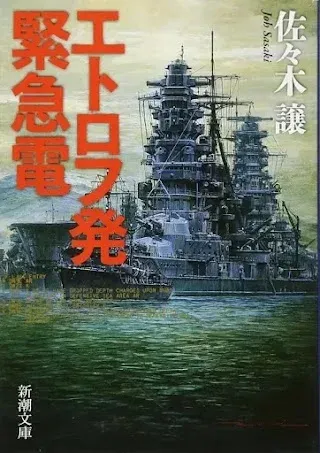

[:contents]

## あらすじ

> 1941年12月8日、日本海軍機動部隊は真珠湾を奇襲。この攻撃の情報をルーズベルトは事前に入手していたか!?海軍機動部隊が極秘裡に集結する択捉島に潜入したアメリカ合衆国の日系人スパイ、ケニー・サイトウ。義勇兵として戦ったスペイン戦争で革命に幻滅し、殺し屋となっていた彼が、激烈な諜報戦が繰り広げられる北海の小島に見たものは何だったのか。山本賞受賞の冒険巨篇。
> -- 本書より引用

## 感想

先の大戦を背景に、その中で時代に翻弄されながらも力強く生きる人達の姿を描いた長編作。

ラストに向かうシーンで、不思議な既視感に見舞われましたが理由がわからず ...

読後に、作品に登場する街などをWikipediaで調べていたのですが、1993年に「エトロフ遥かなり」のタイトルで、NHKドラマ全四話として放送していたそうです。

[https://www2.nhk.or.jp/archives/movies/?id=D0009040292_00000:embed:cite]

私は中高生の頃、小説や漫画を進めてくれる親友の影響でNHKドラマを良く見ていました。

つまり、この作品を全編、映像という形で体験していたのですね。

18年経って小説という形で同じ話に再び巡りあうとは思ってはおらず、一層印象深い作品となりました。

人物がしっかりと描かれていることもあり、時代の並に埋もれること無く、力強く生きる人々に胸を打たれます。

## 著者について

> 1950（昭和25）年、北海道生まれ。広告代理店、自動車メーカー勤務を経て、79年に『鉄騎兵、跳んだ』でオール讀物新人賞受賞。90年、『エトロフ 発緊急電』で日本推理作家協会賞、山本周五郎賞、日本冒険小説協会大賞を受賞。2002年、『武揚伝』で新田次郎文学賞を受賞。また、2010年には『廃 墟に乞う』で直木三十五賞を受賞した。
> -- 本書より引用
