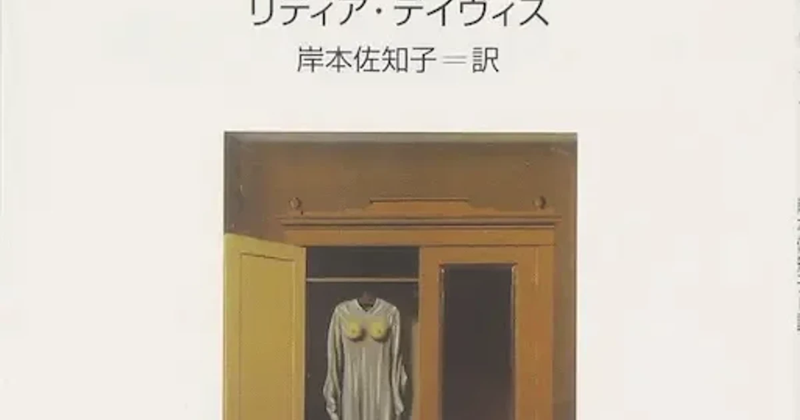

[:contents]

## 『ほとんど記憶のない女』のあらすじ

長短が極端に異なる51篇の短篇集。物語は1篇ごとに大きく内容を変え、散文のような日記のようなお伽話ような話の連続は読者を非日常的感覚に引きずり込む。

## 読書感想

6年も前に、良く読んでいた読書感想ブログに紹介されており、アマゾンのウイッシュリストに登録をした。

深い理由はないのだが、ついつい買いそびれ、6年の時を経てようやく買いもとめ読み終えた。

本の雰囲気を表すため、最初の1篇の最初を引用する。

タイトルは「十三人めの女」

> 十二人の女が住む街に、十三人めの女がいた。誰も彼女の存在を認めようとしなかった。手紙は彼女に届けられず、誰も彼女のことを語らず、誰も彼女のことを訊ねず、誰も・・・ 
> -- 本書より引用

ちなみにこの「十三人めの女」は、もう少し引用すると終わってしまう、とても短い話。

最初の何篇かを読んでいるうちに頭がボーっとなる。

散文的な話しや、唐突に途切れたように終わる話し。

散々心を揺さぶられて、どうにも言いようのない不思議な感覚になる。

これは読んでいて途中で気がついたのだが、話の語り手が見ている視点というか立ち位置がおかしいのだ。

日頃よく読む小説などでは、一人称や三人称視点など、話を見ている視点がわりとはっきりしているものが多い。

本作の多くでは、これが少しずれている。

あるいは、わざとずらしているのか。

それゆえ、読み始めているうちは良くわかっていないのだが、読み進めるにつれ平衡感覚を失うような何とも言えぬ気分になり、不安になる。

「私たちの優しさ」という一篇が、少々個人的にグサッと来るものがあり、上のような状況でこの話が来た時は恐怖だった。

本作を知ることとなったブログを久しぶりに訪れると、2010年の夏以降更新がなかった。

当時、そのブログでコメントを記載し、おもしろいですよと薦めて頂いたあとが残っている。

6年経ってしまったが、読んで良かったとコメントを残した。

気づいてくれるだろうか。

## 著者について

> リディア・デイヴィス　1947年マサチューセッツ州生まれ。ニューヨーク州在住。ビュトール、ブランショ、レリスなどフランス文学の翻訳家としても知られ、プルースト『失われた時を求めて』第一巻『スワン家の方へ』の新訳の功績により、2003年にフランス政府から芸術文化勲章シュヴァリエを授与された。また2010年にはフロベール『ボヴァリー夫人』の新訳を5年がかりで完成させた。 
> -- 本書より引用
