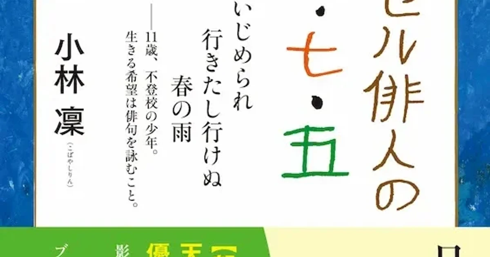

## あらすじ

同級生のいじめ、問題と向きあおうとしない学校。俳号「小林凛」、十一歳の少年は俳句を詠む。俳句に希望を見いだし生き抜いた若き俳人と家族の記録。

## 読書感想

> いじめられ行きたし行けぬ春の雨 
> -- 本書より引用

表紙に掲載されている一句。この句を詠んだ凛太郎さん、俳号は「小林凛」。

出版当時、十一歳の小学生。本作は、彼の作品と絵、そして彼の母、祖母による文章をまとめた作品である。

### 凛太郎さんの境遇

冒頭で母による彼の生い立ちが語られている。壮絶な彼の人生と家族の必死なたたかいが伝わる内容だ。かいつまんでまとめてみる。

凛太郎さんは早産で超低体重児として生まれ、誕生直後から死線をさまよった。

その後も病院通いは続き、彼が生後十ヶ月で離婚した母、祖父母の家族に支えられ、障害を抱えるも無事、小学校へ入学する。

しかし、壮絶な幼児期を生き抜いてきた彼を待っていたのは、障害に対し暴力を伴ういじめを行う同級生と、心ない教育者たちであった。必死に家族は学校とかけ合うが、隠蔽を決め込む学校側には届かない。

一家は「張り切って不登校」を決断する。

### いじめ

毎年いじめを苦に命を落とすものが絶えない。知るたびに胸がふさがる。

最悪の結果にいたる背景として、いじめはもちろんのこと、本人が思いを伝えられない、たとえ伝えても受け取る側がそれを拾えない、といったことがあると思う。

そのいじめにあった凛太郎さんが無事に生き抜いた支えのひとつは「俳句」であった。

彼は四歳の頃、テレビや絵本を通じて俳句に出会い、身近に教えるものがいない中、五・七・五の十七文字で自分の思いを表現するようになったそうだ。彼はどんな苦境においても「俳句」を詠み続け、思いを表現し続けたのだ。

そして、その彼の思いを受け取る家族がちゃんといたこと。障害で筆圧が弱い彼にかわり、祖母は彼の詠む句を逃すことなく携帯メールで母へ送り、夕食後に書字練習をかねて清書をさせた。

また、祖母が懇意にしていたアメリカ在住の教育コンサルタントに彼の作品を送ったところ、作品を評価し、絵を書くことを勧めたという。少ないながらも彼の思いを受け取る人がいたのだ。

俳句でも、絵でも、叫ぶだけでも、どんな手段でもいい。今も苦しんでいる人たちが気持ちを表現できるようにと強く願う。そして私はその思いを聞き逃さないために心を鈍らせてはならないと思う。

### 俳人「小林凛」について

本作は、通常のいじめに関するドキュメンタリーとは大きく異なる。

それは、春からはじまり、そしてまた冬から春へと、四季を巡る形で構成された「小林凛」の作品たちである。

この作品の編者が、作中で当初この話を持ちかけられた時のことを記している。企画としては話が多いものであり当初、出版を躊躇した。

しかし、そのあと送られてきた「小林凛」の一作を見て、本にすることを決意したそうだ。

彼の作品は、多くの大人たちを動かして本を作らせ、私のような俳句に疎いものにも届くほど、力強く素晴らしいものだ。

彼の俳句は自らを生かし、そして家族の心を支え、出版人を動かし、読者を感動させる。

彼の母がつづったエピソードを引用する。

> 夕食後のひととき、にわか俳人（？）三人が句会をする。
> 「ねえ凛、俳句は、余情・余韻の文学と本に書いてあるけど、この意味わかる？」
> 母の問いに、凛は答える。
> 「お寺の鐘がゴーンと鳴って、うわんうわんと響くだろ？　それが心に残ること」 
> -- 本書より引用

聞こえただけでは違う、心に残すことができて余情・余韻となる。私は知らなかった。幼い彼は、それを自然に行い表現することができる、俳人「小林凛」なのだ。

表紙と書中にある一枚の写真、凛太郎さんが両手を左右に広げ、西日で長くなった影を道に写している。小さな背中の彼が、精一杯生きて詠んだ作品から、たくさんのことを教えてもらった。

> ブーメラン返らず蝶となりにけり 
> -- 本書より引用

十歳の時の作品、彼の絵と幼い文字でつづられた句が掲載された一番好きなページ。

投げたブーメランが草むらに消え、そこから蝶が空へと舞い上がる様子を想像する。

その蝶のように、どこまでも自由にこれからも作品を生み続けてほしい。

俳句の素晴らしさ、そのほかたくさんのことを教えてくれてありがとう。

