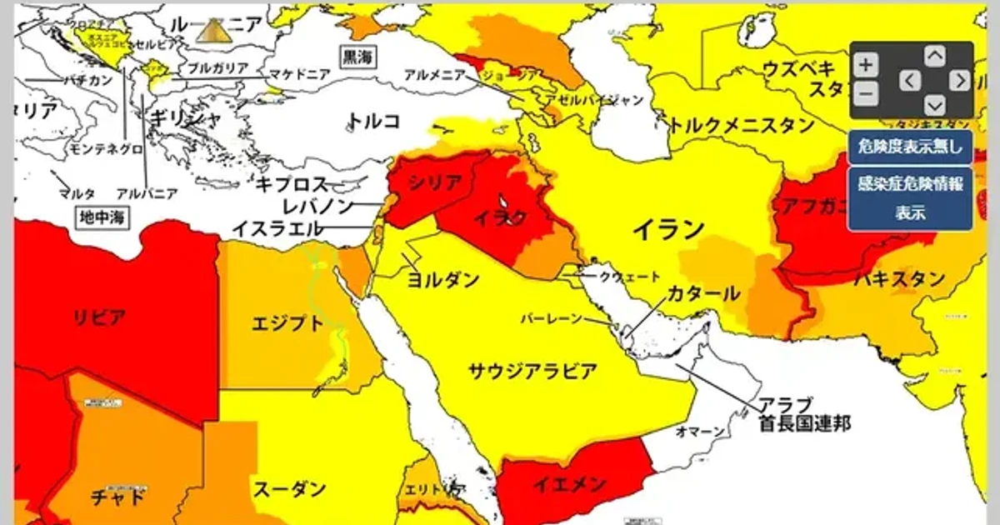

[:contents]

## 危険地域への渡航は間違いなのか？

後藤健二さんがどういう目的で渡航したのかはわからない。

ただ、国が渡航を止めたのに行くのは良くないという意見や、渡航禁止を強制できないかといった意見を目にした。

[https://news.livedoor.com/article/detail/9735766/:embed:cite]

[https://news.livedoor.com/article/detail/9747111/:embed:cite]

## 渡航は正しいか否かという話の前に、法的にどうなのか

> 日本国憲法第22条 
> 1　何人も、公共の福祉に反しない限り、居住、移転及び職業選択の自由を有する。 
> 2　何人も、外国に移住し、又は国籍を離脱する自由を侵されない。 
> -- [コトバンク](https://kotobank.jp/word/%E6%97%A5%E6%9C%AC%E5%9B%BD%E6%86%B2%E6%B3%95%E7%AC%AC%E4%BA%8C%E5%8D%81%E4%BA%8C%E6%9D%A1-684429)より引用

法的には問題ない。

つまり、禁止すべきだという意見は憲法改正ということであり、非難は道徳的な観念についてのものと言える。

## 戦場ジャーナリストという人々

戦場は関係諸国のさまざまな思惑が渦巻くところである。

これまでの歴史において、関係国の政府が戦地への渡航および報道を規制し、いざメディアが報道を始めると次々に真実が明るみになったことは少なくない。

[https://www.nhk.or.jp/bunken/summary/research/history/051.html:embed:cite]

[https://kamogawakosuke.info/1999/06/22/%E7%B1%B3%E5%9B%BD%E3%81%8C%E3%83%A6%E3%83%BC%E3%82%B4%E3%82%92%E7%A9%BA%E7%88%86%E3%81%99%E3%82%8B%E6%9C%AC%E5%BD%93%E3%81%AE%E7%90%86%E7%94%B1/:embed:cite]

[https://www.kyodonews.jp/company/hodo-dokusya/2003/10.html:embed:cite]

過去に多くのジャーナリストが戦場で命を落としているにもかかわらず、自ら赴いて取材をする人間は稀有な存在だと思う。

例えカネのためだ、と言っても命を落とすことと比較してそれは十分な額といえるのだろうか。

先にも述べたとおり、戦場は思惑の宝庫だ。

そして、思惑を抱く側は往々にして、それが明るみに出る　ことを拒む。

真実を確かめ広く報道を行おうとする稀有な彼らは、政府の制止を振り切ることへの非難ではなく、支援をすべき対象ではないかと思う。

戦場ジャーナリストもさまざまであろう。

しかし、支援すべき人、淘汰されるべき人を判断し、情報を広く共有しあう責任は市民の側にあり、政府が規定することではないと考える。

## 危険地域へ行くべき人

誰でも行ってよいものなのか 。

今回のことで言えば、戦場ジャーナリストの後藤さんはよいが、湯川さんはだめなのか。

しかし、後藤さんは戦場ジャーナリストだが、今回の目的は報道だったのか 。

これらは、厳密に区別し、法で規定できることではない。

まっとうなジャーナリストのみが戦地へ行ってよく他はダメだということは、区別できることではない 。

区別できないからという理由だけではないが、だから憲法22条となるのであろう。

今回のようなケースにおいて、国は、その人の職業、渡航の目的とは区別なく保護に全力をつくすべきである。また、われわれはそれに使われる税金をおさめなければならない。

人も、国家も、都合の良いことだけを選びとることはできない 。
