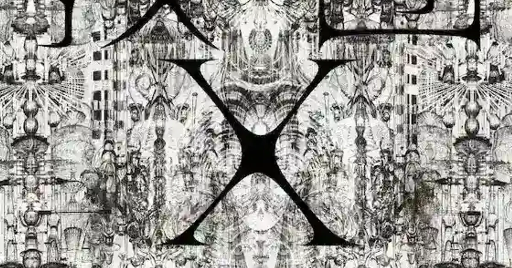

[:contents]

## あらすじ

対をなし存在する「2つの集団」。

ひとつは「沢渡（さわたり）」という男が教祖として君臨し、都内のマンション一棟に潜むカルト宗教であり、そこには多くの若い男女が集っている。その宗教団体は公安や警察に「教団X」と呼ばれマークされている。

もうひとつは、自称アマチュア思索家「松尾正太郎」を教祖とする集団である。しかし宗教団体と言うには遠く、開かれた「ただの屋敷」に自然と人が集まり、松尾の話を聞く会が営まれている。

悪と善、陰と陽を象徴するかのような「2つの集団」が、4人の若き男女を介して交差する物語。

## 感想と考察

> [!CAUTION]
> ※ネタバレ満載です

### あらすじからもう１段階深入ってみる

楢崎という若い男が、突然姿を消した「立花涼子」を探し出すところから物語は始まり、手がかりを伝いたどり着いたのは、松尾という老人の屋敷であった。

松尾の長い奇妙な話が始まる。

もっとも古い仏教の経典である「スッタニパータ」に残されたその内容は、経典が編まれた2000年後にデカルトが唱えた言葉、「我思う、ゆえに我あり」を否定する内容であり、かつ現代における最新の脳科学がたどり着いた理論と奇妙にも符合する。

もっとも古いヒンドゥーの教典「リグ・ヴェーダ」に残されたその内容は、3000年後の現在、人類がたどり着いた宇宙誕生の一説とあまりに酷似している。

松尾はその意味を語り、「人間」を肯定する。
これに対し、沢渡の教団、「教団X」はおびただしい数のセックスで埋め尽くされている。

「セックス教団」と称されるカルト宗教を耳にしたことがあるが、自己を容認できず、居場所もなく孤独に陥った者を、(良し悪しは別として）すべての理屈を飛び越えてセックスで迎えることの効果は大きいのであろうと感じさせられる。

自我を確立できなかった男女が集い、肉体を駆使した営みから精神の安寧を得る。
しかし沢渡はすべてに飽きてしまっており、彼の目的は「滅び」である。
「2つの集団」が交錯し、崩壊が始まる中で「4人の男女」が翻弄される。

### 意味的な部分を考えてみる

これまで人間の極限や究極の悪を作品にしてきた著者は、おびただしい数の参照文献にもある、ありったけの悪を沢渡に投影している。

沢渡という人物は非常に理解しにくい人物であるが、著者は人間の持つ悪意を究極的に純化した状態を描こうと試みてきた経緯があり、それらを参照することでいくらか理解の助けとなるかもしれない。

[https://www.neputa-note.net/2017/04/2/:embed:cite]

そして本作には文献内容を抽象化することをせず、引用に近い形で用いられたおびただしい文章が続く。

これらは本作をあくまで現代という時代にリンクさせるための試みのようにも思える。

一見、松尾と沢渡は正と悪の二元対立の両極に位置するように見えるが、読み進めるうちにそうではない、と感じる。

そうではない、と感じる理由を考えてみる。

松尾と沢渡は、日本がすべての価値を失った終戦直後に同じ師のもとで共に学ぶ同志であった。

その後、沢渡は医師として途上国を巡り、多くの命を救う一方で、追い詰められた女を犯し、後に松尾が語ったある体験をする。その体験とは、仏教で言うところの「悟り」にも似た内容として描かれている。

奇妙ではあるが、対極にあるようなこの2人が、同じ境地へとたどり着くのである。この奇妙な相関はつまり「両極の端と端は同じ」ということを表しているのではないか。

中盤にかけて善と悪を緻密に描き、善と悪を両極へと押し広げてその距離を目一杯に遠ざけたのは、その2つは「人間」が生み出し、「人間」のなかでひとつに帰結する同一のものであることを語るための伏線のように思えてくるのだ。

そして、松尾が語ったこと。（の個人的解釈）

『私たちは「意識」という次元に原子が吸い寄せられる進化の過程で形作られた粒子のかたまりである』

これを感じてしまったら、現に沢渡がすべてに興味を失ってしまったように、何も無くなってしまうのではないか。物語も終わってしまう。しかし、ゴールはここではない。

松尾と彼の妻は最後まで迷える4人の男女を生かそうとし、そして読み手の私たちを含めた全員にこう語りかける。

> 「共に生きましょう！」 
> -- 本書より引用

これは希望である。究極の悪を知り、二極化し、すべてが同じであることを悟る過程を必要とした希望である。著者がこれまで人間の極限や究極の悪を突き詰め作品を生み続けた過程を経てたどり着いた希望である。

## 読後に思うこと

本作は2012年5月から2014年9月までの連載が初出であるが、テロ、人質事件、斬首など、最近のニュースを予言するかのような描写がある。

これまで著者の作品を読んだ後は、自分が人間という生物であることを辛く感じることが多かった。今回はもう本当にダメだと何度も読むのを止めた。

あとがきで著者はあらためて「共に生きましょう」と読者に語りかける。
最後まで読んで本当に良かった、と心から思う。

## 著者について

> 中村文則（なかむら・ふみのり）
> 1977（昭和52）年、愛知県生れ。福島大学卒業。2002(平成14)年、「銃」で新潮新人賞を受賞してデビュー。'04年「遮光」で野間文芸新人賞、'05年「土の中の子供」で芥川賞、'10年『掏摸』で大江健三郎賞を受賞。同作の英語版「The Thief」はウォール・ストリート・ジャーナル紙で「Best Fiction of 2012」の10作品に選ばれた。'14年、日本人で初めて米文学賞「David L. Goodis 賞」を受賞。他の著作に『悪意の手記』『最後の命』『何もかも憂鬱な夜に』『世界の果て』『悪意と仮面のルール』『王国』『迷宮』『惑いの森』『去年の冬、きみと別れ』『A』『教団X』がある。 
> -- 本書より引用

### 中村文則公式サイト

[小説家　中村文則公式サイト -プロフィール-](http://www.nakamurafuminori.jp/)
