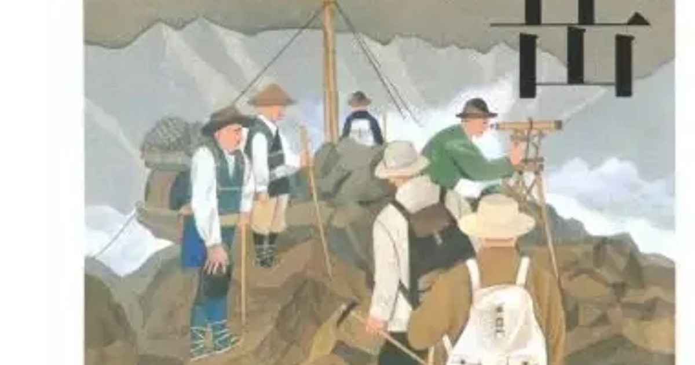

[:contents]

## あらすじ

> 日露戦争直後、前人未到といわれ、また、決して登ってはいけない山と恐れられた北アルプス、劒岳山頂に三角点埋設の至上命令を受けた測量官、柴崎芳太郎。機材の運搬、悪天候、地元の反感など様々な困難と闘いながら柴崎の一行は山頂を目指して進んでゆく。そして、設立間もない日本山岳会隊の影が。山岳小説の白眉といえる。 
> -- 本書より引用

## 感想

山を登り頂上に辿り着くと私はまず三角点を探しその横に足を置いて写真を撮る。その三角点は測量に関わった人達が埋めたものだという知識はあったものの、それを成すためにかけた労苦にまで想像が及ぶことはなかった。

本作は明治時代に国内で未踏峰とされていた立山連峰の剱岳に登頂し測量を行った者達の物語である。若き測量官柴崎芳太郎をはじめ、測量の補助を担う測夫である木山竹吉と生田信、案内人の宇治長次郎と岩木鶴次郎、そして彼らを支えた荷揚げ人夫たち。彼らの命がけの挑戦が胸を打つ。

当時測量部は陸軍の管轄であり、未踏峰・剱岳の測量が測量部のホープ柴崎芳太郎に命じられた。測量するには当然山頂へ到達する必要があるが多くの困難な壁が立ちはだかる。

その壁となる主なものは①不安定な天候と大量の積雪、②険しい地形、③登れない山、登ってはならない山という地元の山岳信仰から受ける心理的障壁といったところだろうか。そして、何よりも軍部が登頂を急かせる要因でもある発足したばかりの日本山岳会よりも先に登るという陸軍の名誉というプレッシャーがかかっている。

これら幾つもの困難を背負いながらも冷静さを失わずに判断重ね登頂を果たした柴崎氏をはじめとしたチームに深い感動を覚える。剱岳登頂が話の中心で目が行きがちであるが、そこに至るまで立山連峰を次々に縦走する逞しさもまた目を見張るものがある。しかも当時の登山道具やウェアの性能は現代とは比べ物にならないほど素朴なものだ。

普段あたり前のように眺めている地図には彼らのような命がけの仕事がその向こうにある。そのことを深く知ることができたのは私にとって本書のもっとも大きな価値であったように思う。

險しい山の山頂に三角点がある、それはすなわちそこまで重たい荷を運び厳しい環境下で測量の仕事を成し遂げた者達がいたことの証でもある。今まで思いを巡らせるに至らなかったその事実を深く知ることができたのは私にとってとても大きいことだ。

今後山の山頂で三角点を目にするとき、これまでとは違った思いを胸に抱くであろう。

## 映像作品について

本作は2009年に映画化されている。

実際に測量を行うシーンなどは非常に複雑であり文字だけでは私の乏しい想像力ではうまくイメージが湧かなかったが過酷な条件の中、測量の仕事を進めていく様子が映画では実際に映像としてみることができる。そして実際の剱岳やそこからの眺望の画もまた素晴らしい。

## 著者について

> 新田次郎（にった・じろう）
> 明治45（1912）年長野県生れ。本名藤原寛人。無線電信講習所（現在電気通信大学）卒業。昭和31（1956）年「強力伝」にて第34回直木賞受賞。41年永年勤続した気象庁を退職。49年「武田信玄」などの作品により第8回吉川英治文学賞受賞。55年2月没。 
> -- 本書より引用

## 「山」に関連する記事

[https://www.neputa-note.net/2018/01/books-about-mountain/:embed:cite]
