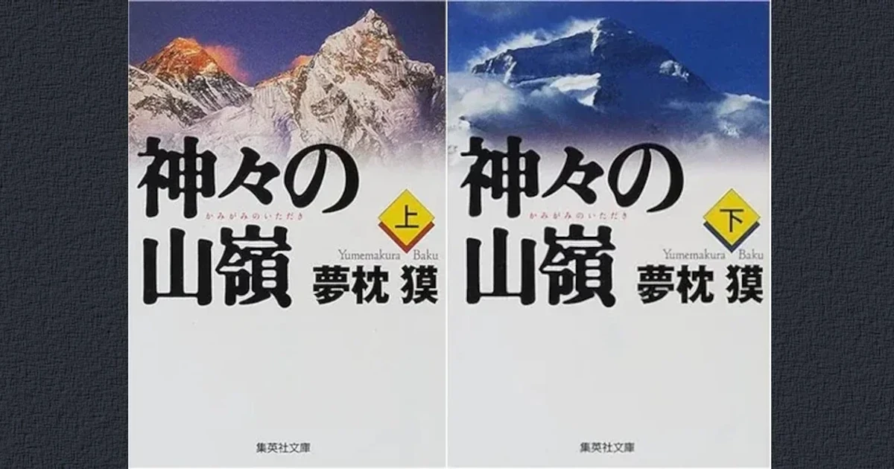

[:contents]

## あらすじ

> その男、羽生丈二。伝説の単独登攀者にして、死なせたパートナーへの罪悪感に苦しむ男。羽生が目指しているのは、前人未到のエヴェレスト南西壁冬期無酸素単独登頂だった。生物の生存を許さぬ8000メートルを越える高所での吐息も凍る登攀が開始される。人はなぜ、山に攀るのか？　永遠のテーマに、いま答えが提示される。柴田錬三郎賞に輝いた山岳小説の新たなる古典！ 
> -- 本書より引用

## 読書感想

> [!CAUTION]
> 以降、ネタバレを含む

2016年3月に公開される映画「エヴェレスト　神々の山嶺（いただき）」を見る前に原作を読んでおこうと思い読み始めた。

映像を見た後に原作を読むと、頭に思い浮かぶ人物や風景がすでに見たシーンで固定されてしまうので、まずは文章を先にと心がけている。

[https://eiga.com/movie/80572/:embed:cite]

### どういう物語なのか、あらすじを整理する

山岳写真を主とするカメラマン深町誠が主人公。ある日彼は山仲間との飲み会でエベレストに挑戦しようと話し合う。

その挑戦は散々たる結果となる。仲間2名を失い深町は気力を失ったままカトマンズに残り、その他のメンバーは傷心を抱えたまま帰国する。

深町はカトマンズの怪しい登山用具で偶然古いカメラを発見する。そのカメラは、20世紀の初頭、エヴェレストに挑んだ英国人マロニーのものではないかと思い至る。

当時マロニーは遭難死しており、それは登頂後か、あるいは登頂前なのかと今尚謎のままである。唯一の手がかりとして彼のカメラが発見され中のフィルムを現像できればその謎が解明される。

このカメラとの出会いは深町の運命の分岐点となる。

カメラの発見場所、発見者を追っていくと羽生丈二というかつて日本登山界の伝説的登山家に行き当たる。

羽生はネパールに住み現役登山家として新たな野心に向かって挑戦を挑もうとしている。まだ誰も成し遂げたことのない「冬期エヴェレスト南西壁無酸素単独登頂」である。深町は羽生に魅せられ、その挑戦を見届けようと共に山に入っていく。

### あらためて感想を

羽生丈二という人物に強く魅せられる。

山に登るためだけに生きているような人物であり、強く、そして激しく山へと情熱を燃やすその姿は眩いばかりだ。

しかし社会的に見れば脱落者である。山に登るたび、仕事を辞め、彼のずば抜けた登攀力に劣る仲間に対して苛烈でありザイルパートナーを見つけるにも苦労する。

羽生が単独行に行き着いたのは自然な成り行きとも言えよう。

ただ、この物語の主人公は深町誠という山岳カメラマンである。読み手は彼の目を通してヒマラヤの山塊や羽生丈二を見ることとなる。

深町はしごく平凡な人物であり、自ら決断をしない優柔不断である側面がしばしば描かれている。羽生丈二とは対象的な存在であり、それゆえ羽生に惹きつけられたのかもしれない。

### 本作品の読みどころ

本書のクライマックスは羽生自身が最後の挑戦と自覚して挑む「冬期エヴェレスト南西壁無酸素単独登頂」であり、その姿をフィルムにおさめようと羽生についていく深町、2人の挑戦である。

他者を寄せ付けない孤高の登山家である羽生が深町に写真を撮ることを許したのはなぜか。

周りに対し常に一方的であった羽生丈二であるが、彼に対して一方的に関わってきた人物が2人いる。ひとりは短い期間であったがザイルを結び合った後輩「岸文太郎」、そしてもう一人が深町である。

岸は羽生と共に登った山で命を落とし、羽生は生涯それを負い目として抱えて生きてきた。誰からも遠ざけられ孤独を歩んできた羽生にとって、ぐいぐいと羽生の人生に関わってくる深町の姿はかつての岸と被るものがある。深町の中に岸の姿を見たのではないか。

### 神々が住む場所、8000メートルの世界とは

本書でヒマラヤの山塊、8000メートルを越える世界を神々が住む場所と表現している。 日々自然の厳しさに直面し生活を営む古代の人々は、その自然の激しさに神を見出した。自然界に畏れを抱き神を思うことは人間にとって原始の記憶に刻まれた行為なのかもしれない。

快適な暮らし＝自然界から隔離された空間での暮らし、都市生活とは斯様なもので、時にそれをも破壊する天災に見舞われたとき、自然の恐ろしさを我々は思い出す。しかし、再び都市空間で時を過ごせばその記憶も薄れる。

アルパインスタイルでもっとも厳しい条件のエヴェレストに向かう羽生の挑戦は、古代の人々が自然界に見出した神々へ近づく、現代に残された唯一の手段のように思える。羽生が力強く登攀していく描写はまさに神々しい光を放つものだ。

> 「そこに山があるからじゃない。ここに、おれがいるからだ。ここにおれがいるから、山に登るんだよ」 
> -- 本書より引用

山に登る理由を問う場面が繰り返し登場する。その中で羽生丈二はこのように答えている。しかし、おそらく羽生自身もこの答えに満足はしていないように思える。

山に登る理由は実際に山に挑んだ者がその場所で感じとるものであり、言語化できるものではないと思うからだ。そしてその感覚は言語が生まれる以前から人類が体感してきたものではないかと思う。

## 読み終えてみて

実際のエヴェレストの登山史に絶妙にリンクしながら羽生丈二という登山家を描き楽しめる作品ではあった。ただ、深町誠という人物の目を通して見なければならない物語であったことがムダを膨らませる要素にも感じる。

シンプルに羽生丈二という登山家の物語を読んでみたかった。

あとがきに編集者から新田次郎のポジションに坐る気はないかと持ちかけられ話が進んでいったとある。新田作品と比べてしまうと程遠いのではないか。

## 参考

[https://www.neputa-note.net/2016/02/blog-post_7/:embed:cite]

[https://www.neputa-note.net/2016/01/blog-post_29/:embed:cite]

## 映画版と原作を比べてみて

- 映画では岡田准一演じる深町がの印象が原作と大きく異なっていた。
- 自分の力のなさや無力さを素直に受け入れる部分は原作と同じであるが、映画ではとても意志的に行動し果敢に羽生へ挑む姿などは素晴らしかった。
- 短い時間で物語をまとめているため話の成り行きに説得力は十分でないかもしれない。
- 2人の男たちが演じる役どころとしては映画の方がわかりやすく納得感もあった。

## 著者について

> 夢枕 獏（ゆめまくら・ばく）
> 1951年神奈川県生れ。東海大学文学部卒業。84年「魔獣狩り」シリーズで若い読者の支持を受ける。89年『上弦の月を喰べる獅子』で第10回日本ＳＦ大賞、89年『神々の山嶺』で第11回柴田錬三郎賞、2011年『大江戸釣客伝』で第39回泉鏡花文学賞、第５回舟橋聖一郎文学賞、12年には第46回吉川英治文学賞を受賞する。著書に「陰陽師」シリーズ、『黒塚 KUROZUKA』など多数。 
> -- 本書より引用

## 「山」に関連する記事

[https://www.neputa-note.net/2018/01/books-about-mountain/:embed:cite]
