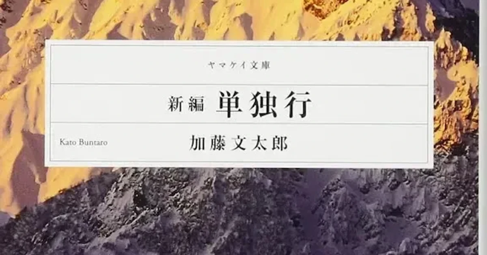

[:contents]

## 本書概要

> 1930年代前半、国内高峰の冬期登山が一般的ではなかった時代に、たったひとりで厳寒の北アルプスを駆け抜け、「不死身の加藤」との異名をとった加藤文太郎。風雪の槍ヶ岳・北鎌尾根に消えたその生涯は、新田次郎の小説『孤高の人』（新潮社）でも知られ、谷甲州の『単独行者』（山と溪谷社）にも描かれているが、彼の真実は残された著作にある。加藤の遺稿集『単独行』を新たな視点で編集し直し、時代背景などの詳細な解説を加え、ヤマケイ・クラシックスシリーズとして生まれ変わった『新編・単独行』を文庫化。永遠の山岳名著が、より手軽に、読みやすくなって新登場。 
> -- 本書より引用

## 読書感想

登山が現代のように一般化する以前、大正から昭和にかけ厳冬期の北アルプスを単独で幾度も踏破した人物「加藤文太郎」。本書は30年という短い人生を駆け抜けた加藤氏の手記と彼と関わりが深かった方たちによる寄稿をまとめた一冊である。

また先日読んだ「孤高の人」のモデルとなった人物でもある。

[https://www.neputa-note.net/2016/02/blog-post_7/:embed:cite]

孤高の人では新田氏による加藤文太郎像が、独自のストーリーを織り交ぜながら描かれており、タイトル通り孤独な一面が強く押し出されている向きもある。

本書の加藤氏や関係者が書いた文章を読み進めていくと、実際は良き友人を持ち小説ほどには孤独ではなかったのだと思いホッとさせられたりもする。

しかし加藤氏の素朴な文章は大変に胸を打つ。余計な脚色を加えたり偉大な実績を誇示することもなく、山行で感じとったことやその足取りを淡々と綴っている。

透明なガラス細工のように繊細で、純粋さが溢れる文章に思わず、その字面を指でなぞってしまう。

甘納豆をかじって元気をつけ、厳しい吹雪を唄をうたってやり過ごし、山頂に到達しバンザイをして喜びを表現する姿が何とも愛おしい。

> 私は信じている、山は、山を本当に愛するものすべてに幸を与えてくれるものだと。 
> --P119 『山と私』より引用

強靭な脚力や吹雪を耐え忍ぶ生命力、体験にもとづくさまざまな工夫など彼の魅力は数多い。しかしもっとも惹きつけられたのは加藤氏の生き様から感じる「そこまで純粋に人は生きることができるのか」という驚きと感動である。

## 著者について

> 加藤 文太郎　かとう・ぶんたろう／ 1905年、兵庫県浜坂町生まれ。1919年、浜坂尋常小学校高等科から三菱内燃機神戸製作所に入社。1923年ごろから山歩きを始め、兵庫県内の国道を歩くトレーニングなどを重ねつつ本格的登山活動に入る。その後、北アルプスや中国山地を舞台に多くの雪山単独登山を実践し、「生まれながらの単独登山者」と称される。新田次郎はその生涯を小説『孤高の人』に、谷甲州は『単独行者（アラインゲンガー）新・加藤文太郎伝』に描いた。1936年1月、風雪の槍ヶ岳北鎌尾根にて遭難死。享年31。 
> -- 本書より引用

## 「山」に関連する記事

[https://www.neputa-note.net/2018/01/books-about-mountain/:embed:cite]
