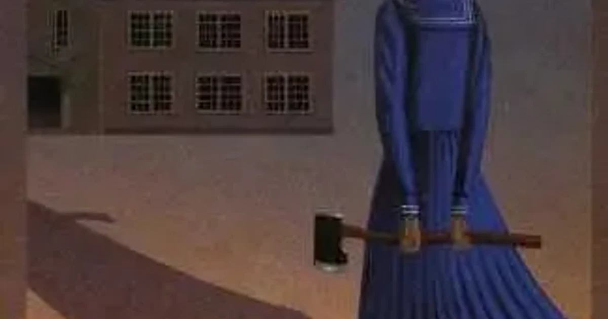

[:contents]

## 『そして誰もいなくなる』あらすじ

> 名門女子校天川学園の百周年記念式典に上演された、高等部演劇部による『そして誰もいなくなった』の舞台上で、最初に服毒死する被害者役の生徒が実際に死亡。上演は中断されたが、その後も演劇部員が芝居の筋書き通りの順序と手段で殺されていく。次のターゲットは私!?　部長の江島小雪は顧問の向坂典子とともに、姿なき犯人に立ち向かうが……。犯人は殺人をゲームにして楽しむ異常嗜好者なのか。学園本格ミステリー。 
> -- 本書より引用

## 読書感想

最近続けざまにミステリ作品を読んでいる。

個人的嗜好を言えば、凝りに凝ったトリックを披露し辻褄さえ合っていればよいとばかりに複雑さを極めた作品よりも、いくらか文学色というか人物や各場面が細やかに描写され頭のなかに情景が浮かぶ作品のほうが強く引き込まれるのでミステリーの要素も一層魅力を増すように感じる。

残念ながら本作は前者である。
しかし、先日読んだ『ルームメイト』という作品で感じた古めかしい表現が交じる独特な文体などに魅力を感じ、また読んでみたいと思ったのだ。

[https://www.neputa-note.net/2016/03/blog-post_26/:embed:cite]

本作はアガサ・クリスティーの「そして誰もいなくなった」をオマージュ作品でもある。その作品を舞台上演した演劇部の女子高生たちが、演じた役の通りに次々に殺されていくという内容だ。

「そして誰もいなくなった」は学生時代に両親の本棚にあったものを読んだ記憶があるが、かなり強引なトリックを展開したパズルゲームのような作品だった記憶がある。

その点は本作も同様に辻褄は合っているとはいえかなり強引だなあと感じる点が多々ある。それでもアガサ・クリスティーの原作同様に殺人が起こるのだろうと読み手に予想できるように誘導し、（事件を期待するのは良くないけれど）はてどのように事件を実現させるのかと考えを巡らせながら読み進めていくのは大いに楽しめる。

そうきたか、そうきたか！、強引だなあと思いながら読み終え、普段毛嫌いしているゴリゴリにトリックを詰め込んだ作品にもかかわらず、なぜ今邑作品を読みたいと思うのかを考えていた。

何となくではあるが、著者はミステリが好きで、ミステリ作品を書くのが楽しくてしょうがないのではないかと感じるところなのだなと思い当たる。

私はひねくれているので作品を読んでいながらついつい書き手の意図を考えてしまうことが多いのだが、ミステリ作品からこのような感じを受けることはこれまでなかったように思う。

## 著者について

> 今邑彩（いまむら　あや）
> 長野県に生まれる。都留文科大学英文科卒。一九八九年、鮎川哲也賞の前身である《鮎川哲也と十三の謎》の13番目の椅子を『卍の殺人』で受賞、デビューを果たす。主な作品に『ｉ（アイ）』『七人の中にいる』『死霊殺人事件』、短篇集『つきまとわれて』などがある。 
> -- 本書より引用
