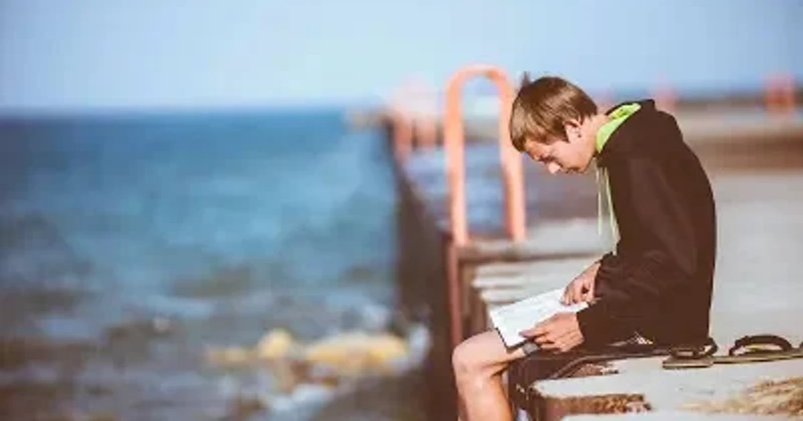

[:contents]

相変わらずNETFLIXの動画を飽きもせず次から次へとまだ見ぬ掘り出しものの作品を見つけ出してはどっぷりとハマる状況が続いている。

「映像」という、文字だけの本よりも単純な視覚的刺激が強いコンテンツ（さらに手を動かすゲームはそれ以上だろうか）に慣れてしまうと、本のただ文字の羅列を追うことが単純に思えてしまい、ますます遠ざかっているというのが恐らくは正しい状況と言えるのではないか。

ふと自分の読書体験を省ってみると、文章を追っていくごとに次々と脳内に像が結ばれ、しだいに現実と脳内に立ち上る世界との境界線が曖昧となり、脳内麻薬全開の恍惚とした体験が幾度もある。これは映像作品からはまだ得ることができていないことではなかったか。

手軽にそこそこの刺激を得やすい映像作品に慣れきってしまい更なる強い刺激を欲しはじめている今日このごろ。

やはり多感な子ども時代から馴染みのある本の世界へと戻るべき時期なのかもしれない。
