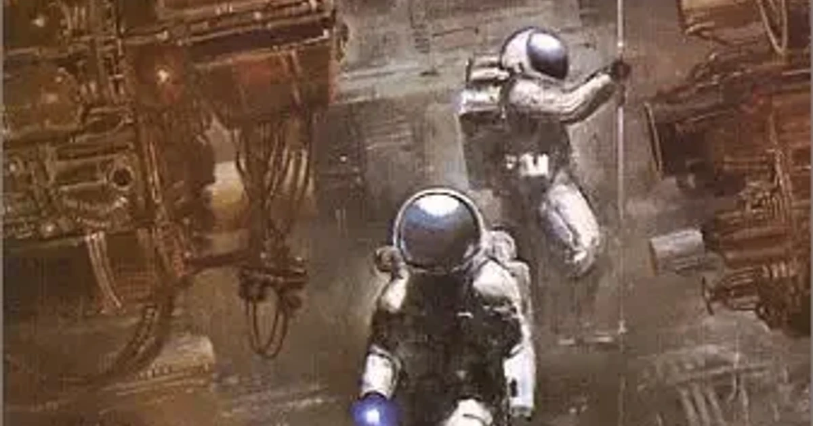

[:contents]

## あらすじ

> 月面調査隊が深紅の宇宙服をまとった死体を発見した。すぐさま地球の研究室で綿密な調査が行われた結果、驚くべき事実が明らかになった。死体はどの月面基地の所属でもなく、世界のいかなる人間でもない。ほとんど現代人と同じ生物であるにもかかわらず、五万年以上も前に死んでいたのだ。謎は謎を呼び、一つの疑問が解決すると、何倍もの疑問が生まれてくる。やがて木星の衛星ガニメデで地球のものではない宇宙船の残骸が発見されたが……。ハードＳＦの新星ジェイムズ・Ｐ・ホーガンの話題の出世作。 
> -- 本書より引用

## 読書感想

### 読みどころ

- 月面調査で死体が見つかる。しかも5万年前に死んでいた人間と相似の生物体。
- 地球上の頭脳を結集して挑む、宇宙と生命の謎。
- 彼らが解き明かしたものは我々人類のルーツであった。

### 感想詳細

本書は先日より利用し始めた電子書籍「Kindle」で読んだ2冊目の小説。

[https://www.neputa-note.net/2016/10/kindle/:embed:cite]

上の三行まとめがすべてであるのだけどもう少し詳しく。

> [!CAUTION]
> 以降、ネタバレを含む

冒頭のプロローグでどこかの惑星で生命の危機に瀕した人物と彼を助けようとする「<b>コリエル</b>」という人物のやりとりが描かれている。

このコリエルという名前は物語の最後の最後まで胸にとめておく必要がある。

次いで本編が始まるのだが時代は2028年、科学技術は宇宙を開拓するほどに進化している世界だ。

月面調査で深紅の宇宙服を身にまとった死体が見つかったことで物語は一気に加速。アメリカの宇宙開発技術をビジネスとする巨大企業IDCCは、イギリス人の科学者ヴィクター・ハント博士と彼が開発したトライマグニスコープという調査機を呼び寄せ、「5万年前に亡くなった月面で見つかった死体」という謎を解き明かすことを依頼する。

この、5万年前に亡くなった生物が月面で見つかる、という時点でワクワクが止まらなかった。そもそも本書を読もうと思ったのは、あらすじ書かれていたこのことがキッカケだ。

その後はさまざまな分野における学者たちが謎ときに挑んでいくのだが、描かれている近未来の描写がおもしろい。

本書が出版されたのは1977年、タバコをプカプカ吸ったり紙の書類をけっこう扱っていたりする近未来の姿は、いま私たちが実際に生きている21世紀という立ち位置から眺めてみると興味深いものがある。（スマホやタブレットが普及したり禁煙がここまで進むとはわからなかったであろう）

学者たちが立てる仮説、意見のぶつかり合いなど、読み応えある場面が続く。だが、解明が一気に進むのは、木星の衛星「ガニメデ」における巨大宇宙船の発見である。

その宇宙船には人間に似た体形を持つ巨人の死体や、かつて地球にいたとされる生物をどこかへ輸送しようとしていた形跡などが残っており、そして何よりその宇宙船が2500万年前の間、ガニメデの氷の下で眠っていたという驚きの事実が明らかとなる。

なんだ、なんなんだ、私をワクワク殺す気か！？

広大な宇宙空間が無限に広がる未知なる発見。大興奮しどおしである。

そして調査の中心を担ってきたヴィクター・ハント博士は、月面の5万年前の死体、そして2500万年前のガニメデの宇宙船がなんであるかを解き明かす仮説を立てる。

それは、我々人類のルーツに迫るものであった。

そしてエピローグ、最後の最後で私の心はふたたび何度目かわからない興奮の渦に。

もう感動のため息を何度もらしたことか。

人情やヒューマニズムといった直接的に心温まるような話が盛り込まれているわけではないけれど、生物の存在、宇宙の存在、そして流れゆく時間が何とも愛おしく思えてくる作品だった。

## 続編について

本作にはスピンオフ的な続編があるようで、そちらもぜひ読んでみよう。

> 続編に『ガニメデの優しい巨人』、『巨人たちの星』、『内なる宇宙』、『Mission to Minerva』(未訳）があり、「巨人たちの星シリーズ」と総称されている。 
> -- [Wikipedia](https://ja.wikipedia.org/wiki/%E6%98%9F%E3%82%92%E7%B6%99%E3%81%90%E3%82%82%E3%81%AE) より引用

## 著者・訳者について

> Ｊ・Ｐ・ホーガン 
> James Patric Hogan 
> イギリスの作家。1941年生まれ。コンピュータ・セールスマンから転身、一気に書き上げた処女作『星を継ぐもの』が翻訳紹介されると同時に爆発的な人気を博する。以降、『創世記機械』、『未来の二つの顔』『未来からのホットライン』など、最新科学技術に挑戦する作品を矢継ぎ早に発表、幅広い読者を獲得している。現代ハードＳＦの旗手と目され、ことごとくがベストセラーとなっている。2010年歿。 
> -- 本書より引用
<!-- -->
> 池　央耿 
> 1940年生まれ。国際基督教大学教養学部卒業。主な訳書、ドン・ペンドルトン「マフィアへの挑戦シリーズ」アシモフ「黒後家蜘蛛の会」1～4ニーヴン＆パーネル「神の目の小さな塵」上・下など多数。 
> -- 本書より引用
