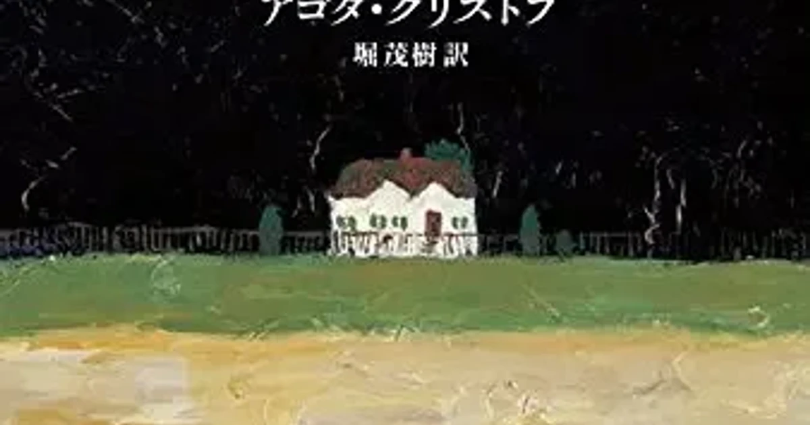

[:contents]

## あらすじ

> ベルリンの壁の崩壊後、双子の一人が何十年ぶりかに、子供の頃の思い出の小さな町に戻ってきた。彼は少年時代を思い返しながら、町をさまよい、ずっと以前に別れたままの兄弟をさがし求める。双子の兄弟がついに再会を果たしたとき、明かされる真実と嘘とは？『悪童日記』と『ふたりの証拠』で全世界の読書界に衝撃と感動を与えたアゴタ・クリストフの連作は、本書をもって完結し、奇跡の三部作の全構造が明らかになる。 
> -- 本書より引用

## 読書感想（ネタバレを含みます）

### 読みどころ

- アゴタ・クリストフの処女作『悪童日記』から続く3部作の完結編。
- 前作、前々作は偽りであることが明かされ、タイトルからして本作も嘘ということなのか！？
- 苦悩に満ちた双子の晩年、そして故国・故郷への強烈な思いが胸を打つ。

### 三部作ついに完結

著者の処女作であり三部作の第一作目「悪童日記」、続篇の第二作目「ふたりの証拠」からさらに時を経て、双子は晩年を送る老人としてこの完結篇に登場する。

[https://www.neputa-note.net/2016/11/epi/:embed:cite]

[https://www.neputa-note.net/2016/12/epi/:embed:cite]

本作は衝撃的な幕開けとなる。日記の体で語られた双子の少年の日々を綴った一作目、一人は亡命し一心同体の二人が離れて過ごした青年期が描かれた二作目は偽りであることが明かされるのだ。

つまり苦しかった日々におけるこうであってほしい希望を含めたフィクションであるとリュカによって明かされる。

そして本作は「第三の嘘」というタイトルだ。解説にもあるが、これは原文を直訳したものとのこと。前作、前々作が偽りであるというならば、本作もまた。..。そんな考えが脳裏をよぎる。

しかし、それについては不明のままである。

### 悲哀に満ちた再会、そして永遠の別れ

祖国に残ったクラウス、隣国へ亡命したリュカの双子。

二人はすでに晩年を迎え、先は長くないと悟ったリュカは祖国へ戻りクラウスとの再会を果たそうとクラウスを探す。

彼らの人生において起こった過去が描写され、実際は苦悩に満ちた人生であることがわかる。悪童日記における生き生きとした双子の姿はそこにはない。あれは妄想の産物であったのかという思いが悲しさを増幅させる。

ひどく苦しい再会の場面、そして結末であった。

亡命先においても祖国、そして故郷の小さな村への思いを大切にし、決して幸福ではなかったが祖国で一生を終えることができたリュカは果たして幸せであったのだろうか。

解説で訳者が触れているのだが、この強烈な故郷への憧憬は作者の実体験に基づくものとあり、その強烈な思いは文章に強く滲み出ており胸を打つ。

### 三部作を読み終えてみて

世界規模で起こった戦争の被害を被った著者が過ごした体験に基づく話ではあるが、彼女はその体験を国や時代を超えて読まれる文学作品へと昇華したことに作家としての凄みを感じる。

できることならば、十代のうちに一度読み、今また読み返すといった体験ができればよかったと心から思う作品であった。

自分に子どもができたならば、物心つくころに読むのを薦めてみたい。

## 著者について

> アゴタ・クリストフ 
> アゴタ・クリストフは1935年ハンガリー生まれ。1956年のハンガリー動乱の折に西側に亡命して以来、スイスのヌーシャテル市に在住している。 
> 1986年にパリのスイユ社から世に送り出したフランス語の処女小説の本書によって一躍脚光を浴びた。その後、続篇にあたる『ふたりの証拠』(88) 「第三の嘘」(91) を発表して三部作を完成させ、力量ある第一級の作家としての地位を確立した。これらの作品は世界20カ国以上で翻訳され、数多くの熱心な読者を獲得した。中でも、日本では1991年に本書が翻訳出版されると、読書界に衝撃と感動の渦が巻き起こり、多くの文学者・作家・評論家から絶賛の声が寄せられた。1995年には著者自身が来日し、アゴタ・クリストフ・ブームが盛り上がり、クリストフ作品は1990年代にもっとも大きな反響を呼び成功した海外文芸となった。作品としては他に小説第4作『昨日』(95)、戯曲集『怪物』『伝染病』がある。 
> -- 本書より引用

## 訳者について

> 堀茂樹 
> 1952年生、フランス文学者、翻訳家 
> 訳書『ふたりの証拠』『第三の嘘』クリストフ 『シンプルな情熱』エルノー（以上早川書房刊）他多数 
> -- 本書より引用
