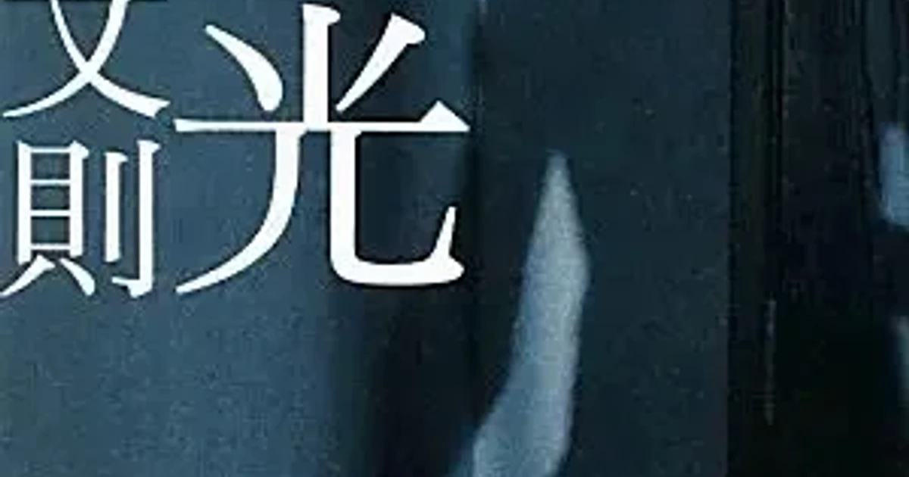

[:contents]

## あらすじ

> 恋人の美紀の事故死を周囲に隠しながら、彼女は今でも生きていると、その幸福を語り続ける男。彼の手元には、黒いビニールに包まれた謎の瓶があった 
> ――。それは純愛か、狂気か。喪失感と行き場のない怒りに覆われた青春を、悲しみに抵抗する「虚言癖」の青年のうちに描き、圧倒的な衝撃と賞賛を集めた野間文芸新人賞受賞作品。若き芥川賞・大江健三郎賞受賞作家の初期決定的代表作。 
> -- 本書より引用

## 読書感想

### 読みどころ

> [!CAUTION]
> 以降、ネタバレを含む

- 文学色が濃厚な中村文則氏の初期の作品。
- 本当の自分（あるいは意識）をまだ捉えきることができない揺れる若き青年の心情を鮮明に描いている。
- その青年をひどく揺さぶるものは恋人の死であり、彼女の体の一部と共にさまよい続ける先に光はあるのか。

### 中村文則作品への思い

中村文則氏の初期の作品というのは本当に好きだ。

後の作品も好きだが、くり返し読み返す頻度で言えば断然初期の作品のほうが多く、本作品はそのうちの1つでもある。

初期作品の特徴といえば一人称が「私」であり、その語りかける先が読者というよりもその主人公自身の内に向かっているような文章が印象的で、好きなところもまさにその点である。

そしてもちろん本作品「遮光」もその印象が濃厚であり、大好物のひとつだ。

[https://www.neputa-note.net/2017/07/jyu-nakamura.fuminori/:embed:cite]

[https://www.neputa-note.net/2015/05/fuminori-nakamura-children-in-the-soil/:embed:cite]

### 青春文学としての遮光

この作品でとくに印象深かったのは2つ、若き青年による若さゆえの揺れまくり揺さぶられまくりの剥き出しの青春と、映画「愛のコリーダ」を彷彿させる狂気と紙一重の純愛である。

主人公は大学生の青年。著者の描く人物でよく見られる傾向だが主人公の彼は自身の言動を強く意識的に捉えようとする。そして冷静にひとつひとつの行為が何かあるいは誰かを演じたものであることを意識する。

こういった振る舞いは自我が固まりきっていない青春時代に誰しも多かれ少なかれあるのではなかろうか。少なくとも私にとっては、若かりし頃の葬り去った黒歴史的過去をちくりちくりと突かれているように感じてしまう。

この辺の妙に意識的で作為的なふるまいの彼の描写は、後半に鎧が崩れ落ち無意識の自我がむき出しになっていく様との落差を生じさせる伏線となる。

### 純愛作品としての遮光

愛のコリーダという映画をご存知だろうか。

私は18歳の頃に見たのだが、そのときは物語の背景よりも目の前のエロさ満点映像で頭がいっぱいだった。

余談だが当時日本ではまだ未公開であり、私は外国でノーモザイク版を見たのだからそれはもう、お察しいただきたい。

で何が言いたかったかというと、愛のコリーダは「阿部サダ事件」をモチーフに純愛を描いており、一人の女性が愛する男の体の一部を切り取って持ち去ったその行為に純愛か、はたまた狂気なのかを考えさせられる作品だった。

そして遮光では主人公の青年が死んだ彼女の指を瓶に入れて持ち歩く。彼は狂気と理性の狭間で揺れまくる。その揺れの振り子がしだいに大きくなり振り切れてしまう。その様は愛のコリーダのサダを彷彿させるところがあったよ、という話なのだが長くなった。

普段あまり恋愛を描いた作品を見たり読んだりしないのだが、この遮光と愛のコリーダは心を激しく揺さぶられる恋愛作品だ。

## まとめ

全体的に暗く重いと感じる作品なのかもしれない。タイトルを文字通り読めば、それは光を遮られた薄暗いものとなるし。

ただ、主人公が美紀の指とともに目指した内なる世界はきっと明るく光が降り注いだ場所である、そんな読後感が残る作品だと記しておきたい。

## 余談

そういえばお笑い芸人の又吉直樹さんがテレビで推薦したりなどで話題となった「教団X」が文庫本で発売されたとのこと。

教団Xは遮光で描いていた要素と比べるとだいぶ広がりを見せていて、おおきなストーリーを描いた長編小説となっている。

宗教、歴史、政治など幅広いテーマをひとつに集約しようと試み著者のたたかいぶりが個人的には印象に残る作品であり、その辺りを以前に書きなぐっているので興味がある方は読んでいただけると嬉しい。

[https://www.neputa-note.net/2015/03/nakamura-fuminori-cult-x/:embed:cite]

## 著者について

> 中村文則 1977(昭和52)年、愛知県生れ。福島大学卒業。2002(平成14)年、「銃」で新潮新人賞を受賞してデビュー。'04年、「遮光」で野間文芸新人賞、'05年、「土の中の子供」で芥川賞、'10年、『掏摸』で大江健三郎賞を受賞。他の著書に『悪意の手記』『最後の命』『何もかも憂鬱な夜に』『世界の果て』『悪意と仮面のルール』がある。 
> 中村文則公式サイト http://www.nakamurafuminori.jp 
> -- 本書より引用
