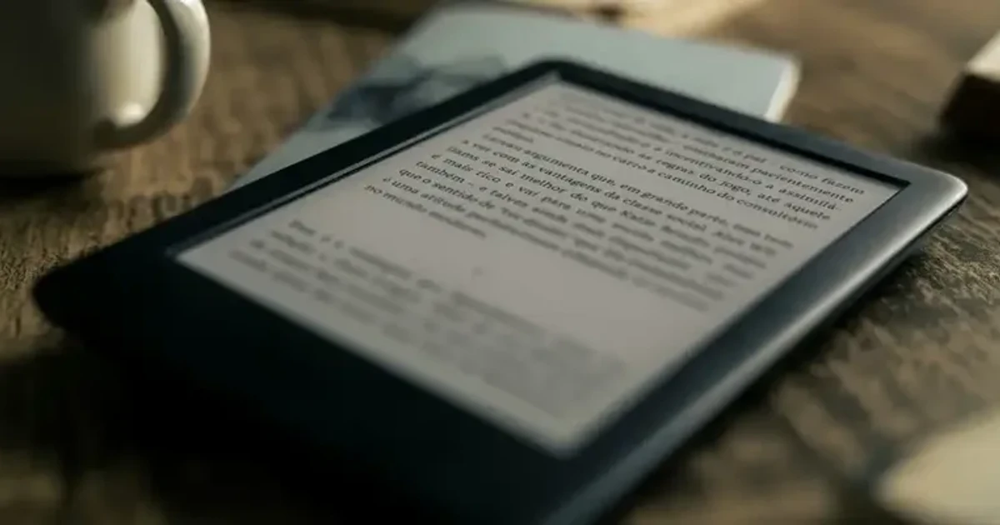
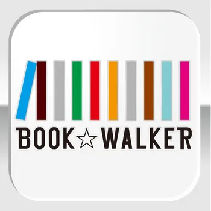
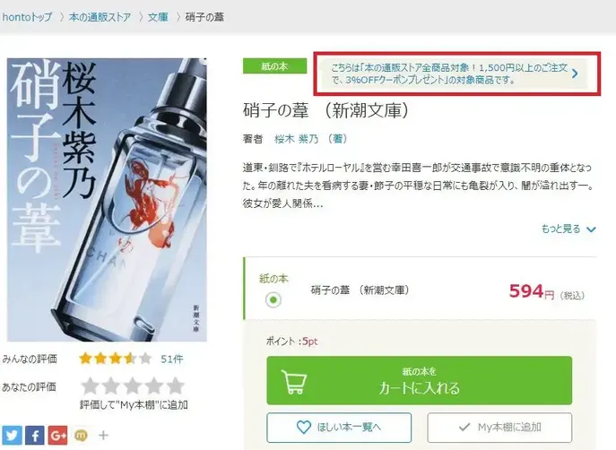
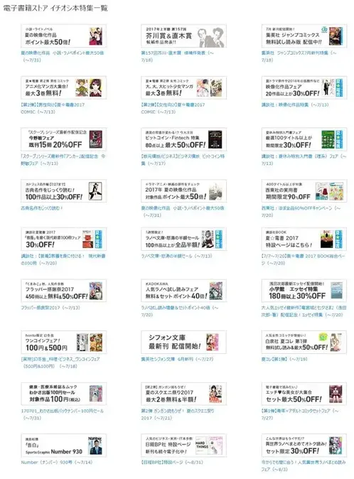
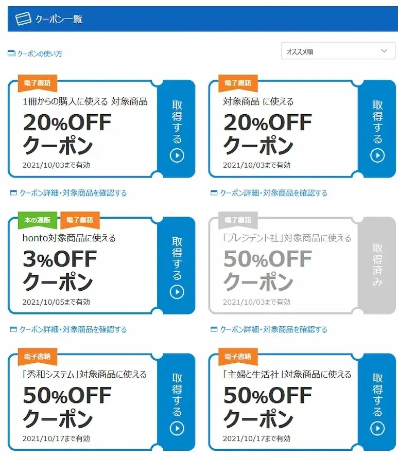
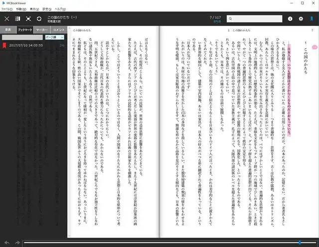
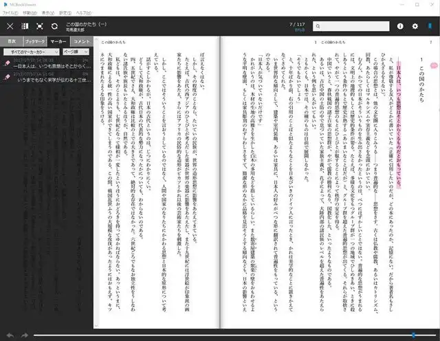
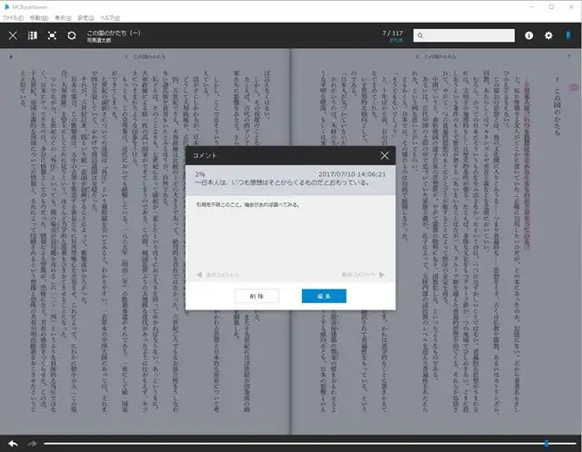

[:contents]

## これまでの経緯

### アマゾンにどっぷり依存した生活を省みる

電子書籍、利用していますか？

そしてどこのサービスを利用していますか？

これまで私はオンラインショッピングをアマゾンに深く依存してきました。

そんなわけで、電子書籍を利用しようと思い立ったときにアマゾンが提供する「Amazon Kindle」を選択するのは極めて自然な流れだったのです。

[https://www.neputa-note.net/2016/10/kindle/:embed:cite]

数あるオンラインサービスの中からどこを選択するかは人それぞれで、自分にあったものを使うのが良いと思います。

なかでもアマゾンは使い勝手がよいうえに有料会員の費用も安く（月あたり325円！）、映像、音楽なども追加料金なしで楽しめます。

気がつけば私のオンライン消費行動の90%以上（金額ベース）をアマゾンが占めておりました。

### 一社依存への警戒感

ただ、何事もそうですが依存しすぎることはよくないという経験則があります。

そして最近、「日本で売上をあげながら法人税を日本で納税してない」や、「日本の出版界を支配する手を強めてきた」などのニュースをきっかけに、今の1社依存状態をどうにかしたいという思いが強くなってきました。

[https://www.nikkei.com/article/DGXLASDZ30HXG_Q7A530C1000000/:embed:cite]

### kindle以外に選択肢はあるのか

2005年から始まったアマゾン依存生活をそろそろ脱するときが来たのではないか？

かつてはアマゾン一強と思っていたけれど、気がつけばいろいろと良いサービスが出てきており、なかにはアマゾンよりも便利なところも見つかりました。

「脱アマゾン、できるだけ国内のサービスを応援も込めて使ってみよう計画」を個人的に進めてきたのがここ2～3ヵ月のことです。

そしていよいよ、電子書籍という聖域に大きなメスを入れる時を迎え、比較、選定から移行の四苦八苦などを書くのが今回の主題です。

ここまで長くてすいません。

> [!NOTE]
> ※追記 2024/12/15

紙の書籍販売が終了となってしまいました。電子書籍は継続、紙の本は「e-hon」との外部連携で提供となります。詳しくは以下をご参照ください。

[https://honto.jp/info/detail_041000083226.html:embed:cite]

> [!NOTE]
> hontoのサービスを詳細に紹介する記事を書いた（2022/01/22）

[https://www.neputa-note.net/2022/01/i-recommend-honto/:embed:cite]

## 電子書籍10サービスを比較

たくさんありますね、電子書籍サービス。

これだけあると調べるだけでひと苦労だし、悩まずKindle選んで正解なんじゃないか？意味あるのか？いきなり途方に暮れてしまいました。

ということで、「まずは条件を絞り込み、それに合致するものが見つかったらそれに決める方式」をとることにしました。

何を条件としたかは以下のとおり。

- Kindleと同等、あるいはそれ以上にポイント、割引などで安く買える。
- 電子書籍リーダーのアプリに栞、メモ、複数端末での進捗同期がある。
- 「無料で読める」が充実している。

他にも細かい要望はあるけれど、まずはこの3つをクリアできれば良しとしようということで調査を始めました。

とりあえず2016年度の電子書籍利用状況を調査したレポートを参考にしてみました。

[https://mmdlabo.jp/investigation/detail_1534.html:embed:cite]

このレポートに各サービスの利用状況調査も載っていますが、やっぱりKindle強しです。

> [!NOTE]
> 追記：2021/10/01

最近の電子書籍の市場シェアはどうなっているだろうと調べてみたところ、現在はマンガ専門のサービスが上位を占めており、わずか数年で様相が変わっていることに驚いた。

それでもやはりKindleはトップに君臨しておりその影響力は相変わらず。hontoにはホントがんばってほしいところ。

[https://webtan.impress.co.jp/n/2020/08/21/37186:embed:cite]

2位以下から選ぼうと思うのですが、すべてをこまかく調べるのは大変です。

まずは個人的に抱いているイメージ、偏見などなどで強引に絞り込んで比較してみることにしました。

### Amazon Kindle

[https://www.amazon.co.jp/kindle-dbs/storefront?storeType=browse&node=2275256051:embed:cite]

現在使用しているKindleです。

読み放題サービスの先駆け「Kindle unlimited」、聞く読書「Audible」など電子書籍サービス全般において「覇者」という感じです。

しかし、前述したとおり今回はKindle以外で探すということで詳細は割愛します。

### 楽天Kobo

[https://books.rakuten.co.jp/e-book/:embed:cite]

- いちど加入してしまうと地獄の底までスパムメールを送りつけるサービスとして有名ですね、「楽天グループ」。
- 順調に利用者を伸ばしているようですが、我が家の家訓により楽天メールを受信することができないので断腸の思いで却下。

### iBooks

[https://appli-world.jp/posts/3639:embed:cite]

- 私はリンゴのマークが入った端末（アップル社）を持っていません。
- 当然MacBookも持っていないので、スターバックスコーヒーも利用できない有様です。
- Apple社自体は好きですし、かつてデザイン畑で仕事してた時はMacユーザーでしたが、現状を鑑みご縁がないので却下。

### Reader Store

[https://ebookstore.sony.jp/:embed:cite]

- （かつて昔は）天下の「ソニー」、が提供するサービスです。
- 海外の電子書籍マーケットを閉鎖したり、書籍リーダーを撤退したりいまいち本気度が感じられないメーカーという印象です。
- 今や昔ですがウォークマンなどお世話になっていたし、頑張ってほしい気持ちはあるのですが、情けは人の為ならず、却下です。

### honto

- 印刷大手から電子サービス分野まで幅広く手掛ける「大日本印刷」と、かつて変なキノコをアイコンとして猛プッシュしていた「NTTドコモ」の合弁サービスです。
- ドコモの参画がどんなメリットを生み出してるのか謎ですが、ちらほら見るニュースでは好印象、ということで候補とします。

### eBookJapan

- 「ヤフー」や「ソフトバンク」の子会社が運営しているサービスです。
- マンガが主力で小説や一般書籍を提供していないこと、野球のソフトバンクホークスが強すぎることの2点により残念ながら却下といたします。

### LINE マンガ

[https://manga.line.me/:embed:cite]

- 泣く子も黙るほど今やメッセージアプリの代名詞「LINE」が提供するサービス。
- LINEは日々使いますが、こちらもeBookJapanと同様マンガサービスが主体なのと、アイコンが緑色であることを理由に泣く泣く却下です。

### BOOK☆WALKER

- 最近は陰りを見せ始めたニコニコ動画のドワンゴとラノベ漫画の猛者カドカワが合体した「株式会社KADOKAWA・DWANGO」(だから名前つなげるのはヤメよう）が提供するサービスです。
- 特定の出版社が提供するサービスだと、読みたい他社の作品がないケースにぶち当たる不安があるので却下とします。

### 紀伊国屋BookWeb

- 以前は近くに店舗があったこともありよく利用していた「紀伊国屋書店」ですが最近はすっかりご無沙汰です。
- 電子書籍サービスであれば店舗への距離は関係ないし、いい本屋さんだという思いはあります。
- ただ、実店舗がメインの会社がどこまで電子書籍に力を入れるのか不透明であることがアンケート調査の順位に表れているような気がするので、断腸の思いで却下といたします。

> [!NOTE]
> 追記：2017/07/12

紀伊国屋のリーダーアプリ「Kinoppy」はアップルのiBooksに先駆けて縦書きEPUB3に対応するなど、EPUBフォーマットの牽引役として頑張っているそうです。

hontoと詳しく比較してよく考えてみればよかったなあと後悔。

### DMM.com電子書籍

[https://book.dmm.com/:embed:cite]

- アダルトなサービスで稼いだ豊富な資金であらゆるサービスに参入し価格破壊をもたらすオンラインビジネス界の暴れん坊将軍「DMMグループ」が提供するサービスです。
- 他のサービスをいろいろ使っていればポイントを相互に利用できて便利だったりすると思うのですが、そういうわけでもないので却下としようと思います。
- ただ本気を出したらきっと伸びるんだろうなとも思います。

## honto のメリットを調べてみる

ざっとですがひとつひとつ調べてみた結果、個人的になにかしらのマイナス要素がもっともないのは「honto」という結論になりました。

しょうもない解説を読んでいただいた方はほんとうにありがとうございます。

ここで当初かかげた条件をふり返ってみつつ、hontoのサービスを調べた結果をまとめてみたいと思います。

### Kindleと同等、あるいはそれ以上にポイント、割引などで安く買える

Kindle Storeでは「セール」と「ポイント還元」の2つで価格を下げるサービスを行っていますが、若干ちがいはあるけれど場合によっては同程度の安値で購入することが可能だったりします。

#### セールとクーポン

期間限定価格などのセールはKindleと同じですが、「クーポン配布」が特徴と言えます。ほしい本を対象としたクーポンがあるかは各書籍のページに表示されます。

親の仇のようにクーポンをばらまきまくっている印象があります。

2017年7月8日現在で配布しているクーポンはこんな感じです。

> [!NOTE]
> ※追記：2021/10/01

hontoのクーポンは現在もいろいろ種類があり20%オフなどはかなり頻繁に配布されています。

出版社単位で50%オフクーポンもあるので「ほしい本」リストを日頃から充実され、大幅値下げのクーポンが出たときにまとめ買いするとかなりお得です。

#### ポイントサービス

電子書籍はもちろん、紙の本を購入してもポイントがもらえます。

また、ポイントの還元率を増やしてくれるクーポンもあるので、セールによる値引き＆還元ポイント追加クーポンのコンボが決まればかなりお得になります。

うまくいけばKindle Storeよりも安く買えるケースもあるし、この条件については及第点としました。

### アプリに栞・メモ・複数端末の進捗同期がある

Kindleのように専用端末はありません。

アプリをインストールして利用することになり、対象OSはWindows、Mac、Android、iOSなど普及しているOSはカバーできていると思います。

[https://honto.jp/ebook/dlinfo.html:embed:cite]

肝心の栞やメモ、複数端末の同期についてですが、ひとつのアカウントで5台まで、進捗や栞、メモなどをクラウドサーバ経由で同期できます。

ページ単位でブックマークをつけたり

マーカーを引いた場所はサイドメニューで一覧確認できる

コメントを残すことも

Kindleアプリに比べてページをめくる手ごたえがないので慣れる必要があるなと感じましたが、ほしい機能は揃っているので良しとします。

### 「無料で読める」が充実している

よくあるコミックスの1巻だけとか3巻までといったものになりますが、無料で読める作品は多数あります。

どのぐらいあるかというと、総数は不明ですが、マウスホイールが火を噴く勢いで1分ほどスクロールしてもまだ読み込む先がある、といった感じです。

気になるマンガ作品はこれで試し読みしてから残りを買いたいので、まずは十分かなあと思います。

### その他いいなと思ったサービス

以降は当初の条件としてはいなかったけれど、いろいろ調べてみて気に入ったサービスを列挙します。

#### 紙の本は一冊から送料無料でお届け

- 提携リアル書店（丸善・ジュンク堂・文教堂・啓林堂）でポイント利用が可能。
- 上記店舗にアプリでチェックインするとポイントがもらえる。
- EPUBファイルのインポートが可能。

#### 紙の本の送料について

> [!NOTE]
> ※追記：2018/10/01

2018年10月1日（月）より、紙の本の送料は下記のとおり有料となってしまいました。

- 3,000円（税込）以上のご注文…無料
- 3,000円（税込）未満のご注文…330円（税込）

[honto 本の通販ストア 10月1日より「店舗お受け取り」サービス強化！～同日より「店舗お受け取り」サービスの初利用で50ポイントプレゼント～ | hontoPR事務局のプレスリリース](https://prtimes.jp/main/html/rd/p/000000258.000009424.html)

#### 読割50

> [!NOTE]
> はてなブックマークのコメントを参考に追記（2017/07/12）

これは調べていたときに気づかなかったのですが、このサービスは、hontoおよび特定の書店（丸善・ジュンク堂・文教堂）で購入した紙の本を、5年間のあいだ同一タイトルの電子書籍を半額で買えるサービスです。

[https://honto.jp/service/yomiwari50.html:embed:cite]

あくまでhontoのアカウントを作ってから購入記録がなされた本のみが対象となりますが、紙と電子書籍を併用していて電子書籍に買い替えたいと思った場合にはとてもうれしいですね。

私はまさに併用利用者ですので、こういった機会が訪れると思いますのでぜひ活用したいと思います。

## Kindleで読んでいる本をhontoに移行はできるのか？

結論から言うと、「できるけど止めた方がいい」としました。

理由としては以下の3点です。

- KindleのDRM保護って解除していいのか不安
- EPUB変換でコンテンツの劣化を防ぐのが面倒そう
- hontoのインポート機能が使いづらい

Kindleの「.AZW」というファイルにはDRM（デジタル著作権管理）という保護がかけられています。

これらを解除するツールがあるので、やろうと思えばできるけれどそれってどうなの、という問題があります。

そして、実際に解除してEPUBに変換した方々の例を調べてまわったのですが、縦書きの文章、コミックの画像が相当程度、劣化しているなあという印象でした。

また、hontoのEPUBファイルのインポートはかなり深い階層にファイルを配置する必要がある。かつ一冊ずつの読み込みとなるなど、多用したい人にはオススメできないと感じました。（※いずれ改善されるかもしれませんが2017年7月現在の状況）

## 終わりに：移行してみての感想

まだまだほしい本が紙の本のみであることが多いし、時間をかけて読みたいものはやっぱり紙の方がいいという思いもあるので、おそらく私は紙と電子書籍の両方を併用していくと思います。

そんな中で急遽思い立った今回のKindleからhontoへの乗り換えは、果たして誰かのためになる記事であるかはかなり疑問ですが、ざざざっと書いてみた次第です。

Kindleで購入したものは、Kindleで読むと割り切って、hontoを使い始めたのですが、今のところ快適に電子書籍ライフを送っています。

何かと便利なAmazon
Kindleでしたが、彼らは日本の出版界の未来は眼中にはないように感じます。少しでもhontoユーザが増え、いつしかKindleを追い抜くほどのサービスに育ってほしいところです。

もし気になる方はぜひとも利用してみてほしいと思います。

ひとりでも多くの人が素敵な本と出会い、充実した読書体験を送れるといいなあと、1人の読書好きとして祈っています。

長文・駄文しついれいしました！

もしよろしければこの記事をシェアしていただけるととても励みになります。
