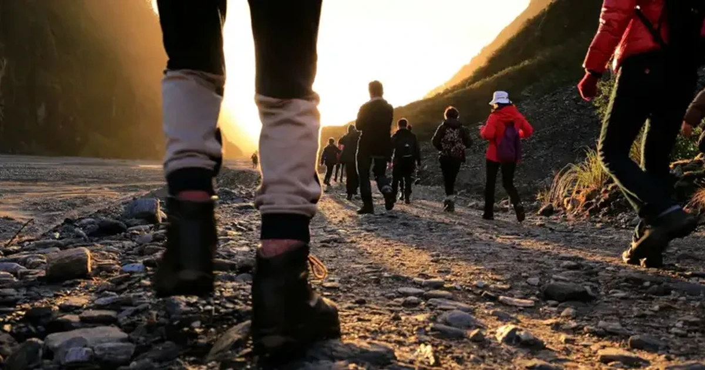

[:contents]

## 「山」に興味を持つにいたるまで

突然ですが、「山」は好きですか？

遠くから美しい山の稜線を眺めたり、一歩ずつ足を踏み入れ頂上を目指したり。いつからか私はすっかり山の虜になってしまいました。

もとはと言えば、身近に登山をする人がいたことや、『岳』という山岳救助をテーマにした漫画を読んだことがキッカケでした。

そして、あちこちの山へ足を運ぶようになるのと同時に、もともと読書好きな私が「山にまつわる本」を探し求めたことは自然な流れでした。

登山をする方はすでに知っているものが多いかもしれません。何か自然あふれる本を読んでみたい方や、まだ読んでいない方の参考になることを願いつつ紹介してみたいと思います。

## 山にまつわる本　～小説編～

### マークスの山　（高村薫）

山への興味を自覚する以前に、高村薫の「マークスの山」を読んだことがありました。

[https://www.neputa-note.net/2015/11/takamura-kaoru.marks-mountain/:embed:cite]

直木賞を受賞し、ドラマや映画にもなったことで、ご存知の方も多いかと思います。有名な警察ミステリ作品ですね。

私は学生のときに読み、日本で2番目に高い山が「北岳」であること、冬の北岳のテントの中で雪崩の音を耳にするシーンが印象に残っています。このことは大人になってからもしばしば思い出すことがあります。

そして登山をするようになって最初に出会ったのが新田次郎作品でした。

### 冬山の掟　（新田次郎）

最初に読んだのがこちらです。

[https://www.neputa-note.net/2016/01/blog-post_31/:embed:cite]

新田さんは富士山の気象台で仕事をする気象職員を経て作家になられた方で、数多くの山岳小説を残されています。

[新田次郎 - Wikipedia](https://ja.wikipedia.org/wiki/%E6%96%B0%E7%94%B0%E6%AC%A1%E9%83%8E)

「冬山の掟」は、厳しい自然条件のもとで愚かな振る舞いをする人間がたどる運命を記した短編小説です。

文明の力に守られた町では平気な振るまいも、剥き出しの自然環境の下では命取りになることがあります。

この点は、山岳小説に共通して描かれていることのひとつです。

### 劒岳 〈点の記〉　（新田次郎）

続いて読んだのがこの作品。

「点の記」というのは測量の記録のことです。

[点の記 - Wikipedia](https://ja.wikipedia.org/wiki/%E7%82%B9%E3%81%AE%E8%A8%98)

明治時代に日本国内の山はほとんど測量が完了し、標高がわかっておりました。しかし北アルプスの「劒岳」は前人未到の山として残されていたそうです。

そして、当時インポッシブルと言われていたミッションをコンプリートした勇敢な測量士を描いたのがこの作品です。

迫力ある劒岳の描写と山に挑む人間の姿に魅せられます。

また浅野忠信主演の映画も素晴らしかったので興味がある方にはぜひ見てほしいです。

[https://www.neputa-note.net/2016/01/blog-post_29/:embed:cite]

### 孤高の人　（新田次郎）

こちらは「加藤文太郎」という、昭和初期の実在した登山家を描いた小説です。

登山道具も今ほど進化しておらず、単独で冬山に挑むのが一般的ではなかった時代に、いくつもの山行記録を残した孤独な登山家の姿が見事な文章でつづられています。

社会においては不器用で無愛想な文太郎ですが、彼の山や自然との向き合い方、その純粋な気持ちからは多くの学びが得られるのではないでしょうか。

一人で登山をしていた私に大きな勇気をくれた作品でもあります。

[https://www.neputa-note.net/2016/02/blog-post_7/:embed:cite]

### 神々の山嶺（夢枕獏）

V6の岡田准一さんが主演した映画で話題になった作品です。

孤高の人の文太郎と同様に孤独な登山家と、エヴェレストに挑む彼の勇姿をフィルムに収めようと奮闘するカメラマンの物語です。

山に挑む場面はとても迫力がありますが、どちらかといえば人間ドラマとしての要素が幾分強い作品でもありますね。

[https://www.neputa-note.net/2016/02/blog-post_16/:embed:cite]

## 山にまつわる本　～ノンフィクション編～

ここからはノンフィクション作品と登山家による手記などを紹介します。

### 凍　（沢木耕太郎）

山野井泰史さんというフリークライミングやアイスクライミングを得意とする世界的なクライマーを描いたノンフィクション小説です。

登山家自身が書いた本は、淡々とした生々しさはあるのですが、表現がいくらか控えめだったりします。この作品は、山野井さんが見た景色をプロの筆力によって表現されており、臨場感あふれるクライミングの描写などは圧巻です。

読んでいるあいだ、実際手に汗をかくほどでした。

[https://www.neputa-note.net/2016/03/blog-post/:embed:cite]

### アルピニズムと死　（山野井泰史）

こちらは「凍」の主人公、山野井さん自身が書かれた本です。

いつ死んでもおかしくないと思われるほど強烈な山行をいくつも超えてきた山野井さんが、彼自身のキャリアを振り返り、生きて登り続けられた理由を探求します。

登山家は山で命を落とすことはやはり多いのです。

名前を知り、気になって調べてみると亡くなられている、ということがよくあります。

なぜ死なずにいられたかは不思議と思えるほど過酷な挑戦をしてきた、本人の言葉でその一端が語られている貴重な本です。

[https://www.neputa-note.net/2016/03/blog-post_23/:embed:cite]

### サバイバル登山家　（服部文祥）

登山家であり、山岳雑誌「岳人」の編集者でもある服部文祥さんの著作。

この方の文章、思考、行動は非常にユニークで、この一冊にはそんな彼の魅力が詰まっています。

現代における登山道具というのは非常に進化しており、夏は涼しく、冬は暖かく、荷物は年々軽量化されています。

自然と対峙するはずの登山が、道具の進化によりますます自然との距離が離れてしまうとは皮肉なものです。

そこで現代登山は自然に対してフェアではない、と考え可能な限り道具や装備を減らし、自給自足で山を歩こうとする試みを綴ったのがこの作品です。

人間は文明の進化とともに生物として退化していると思います。それに逆行し、原始の力を取り戻さんとする試みは目を見張るものがあります。

[https://www.neputa-note.net/2016/01/blog-post/:embed:cite]

### 百年前の山を旅する　（服部文祥）

同じく服部文祥さんの著作ですが、こちらは消えゆく山の古道をたどった旅を記録したものです。

山を歩く行為は何も現代人だけに限ったことではなく、遥か昔から人々は生きるために山道を開き生活していたことがよくわかる内容です。

そして個性的な著者の着眼点はおもしろく、選ばれた山道はどれもが興味深い。

わたしたちの祖先の暮らしを知る旅でもあり多くを考えるきっかけにもなります。

[https://www.neputa-note.net/2016/02/blog-post/:embed:cite]

### 青春を山に賭けて

日本を代表する冒険家「植村直己」さんが記した自伝です。

まだ見ぬ景色を見たい一心で、人間はここまで行動できるものなのかと圧倒されます。

日本を飛び出しヨーロッパ、アフリカ、南米、北米、果ては南極まで目指そうという彼の冒険はとどまることを知らない。

そして彼の純粋さが国や人種を越えて人々の心を開き、そして冒険の道も開けていったその事実に心を動かされます。

[https://www.neputa-note.net/2016/02/blog-post_11/:embed:cite]

### エベレストを越えて　（植村直己）

こちらは植村さんの冒険のひとつ、エベレストへの挑戦を綴った作品です。

およそ生物が生存し得ない環境下で起こる人間たちのドラマは、どこか世界の縮図、はたまた人類の歴史を見るに近いものを感じます。

そんな中において、彼の感じ方、考え方はやはりどこか違っています。

歴史に名を刻むほどの大事は、良心だけでは足りないけれど、欲望や野心だけでもダメなのだと、植村さんは教えてくれます。

[https://www.neputa-note.net/2016/01/blog-post_30/:embed:cite]

### 新編 単独行　（加藤文太郎）

新田次郎さんの「孤高の人」の主人公、加藤文太郎ご本人による手記をまとめた本です。

孤高の人はやはり小説でありフィクションとして読み応えがありましたが、実際には異なる部分もあったようです。

といってもやはり孤高の人であったことは変わりなく、日本の登山史における新境地を開いたことや、自然に対し真摯な気持ちで向き合っていたことが、文章から感じ取れます。

雪山のように真っ白く純粋な彼の思いに胸を打たれます。

[https://www.neputa-note.net/2016/02/blog-post_23/:embed:cite]

### 空飛ぶ山岳救助隊　（羽根田治）

遭難時に活躍するヘリコプターの救助について書かれた本です。

ヘリコプターを使った救助というのは非常に歴史が浅く、実は篠原秋彦という一人の人物に依存したものでした。衝撃的な事実が書かれています。

この篠原さんは、漫画「岳」に登場する牧さんのモデルにもなっているそうです。

山を楽しませていただいている一人として知っておくべきことがたくさん書かれている一冊でした。

[https://www.neputa-note.net/2015/11/blog-post_4/:embed:cite]

## 山にまつわる本　〜番外編〜

### 神さまたちの遊ぶ庭　（宮下奈都）

最後に、山はほとんど関係ないと言えばそうなのですが、トムラウシ山のある村を舞台にした作品ということで紹介をしたいと思います。

トムラウシ山は大きな遭難事故が起きてしまったことで怖いイメージを持つ人もいるかもしれませんが、自然はときに、人間に牙を向くものだというのはどこでも一緒。厳しくもあり優しくもある、その両面をもつのが自然の姿なのだと思います。

この作品は北海道のトムラウシに期間限定で移住した一家の暮らしを綴ったエッセイです。

都市部で多くの人が暮らす現代において、大自然の中で生活する彼らの姿は新鮮に映るのではないでしょうか。

[https://www.neputa-note.net/2015/05/blog-post/:embed:cite]

### 終わりに

長々と個人の趣味をただただ暴露していくような記事になってしまいましたが、こういう切り口で本を読んでいくのをおもしろいと感じる人間もいるのだなあぐらいに思っていただけたらと思います。

またこの駄文が奇跡的に素敵な本との出会いをもたらすキッカケとなりましたら幸い至極でございます。

文明にひたり生物として弱くなっていることに震える私としては、まだ見ぬ山の本との出会いを渇望しております。どなたか教えていただけるとうれしいいです。

長文・駄文しつれいしました！
