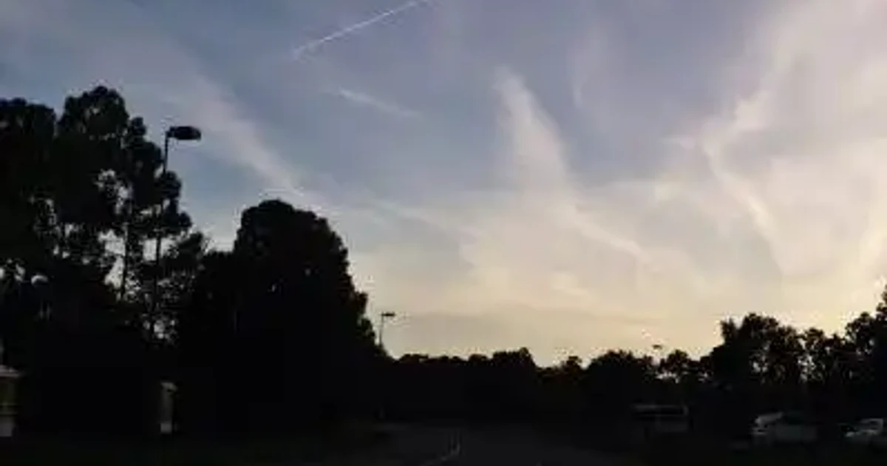

[:contents]

## 最近のマイブームについて（恩田陸さんの著書『夜のピクニック』とは関係ない）

自宅を出てから徒歩30秒ほどのところに、とても大きな公園がある。陸上のトラック、野球場、プール付きの体育館のほか、鹿やウサギやインコが飼育されている小屋、そして子ども向けの遊具などがそろう、とても立派な市民公園だ。

最近は日が暮れても温かな陽気となったせいか、夕食を終えると、同居人とこの公園へと散歩に出かけることが多くなった。

ただ散歩するだけはつまらない、ということで食後のコーヒーやお茶を水筒に入れ、菓子類なども少しばかりポケットに詰め、夜の公園でささやかなピクニックとしゃれこむ。

面倒なときなどはマグカップにコーヒーを淹れ、二人そろって片手にマグカップ、片手にお菓子を鷲掴んだまま、ぞろぞろ公園へと移動する。ご近所の方に驚かれたこともあるが気にしない。

陽気につられて訪れるのは我々だけではない。近くに高校や中学校があるせいか、なかなか家に帰ろうとせず、青春時代のささやきを交わしあう若者たちの姿もちらほら。いい大人なので邪魔はしない。安心して会話が続けられるよう適度な距離を保って腰をおろす。

帰り道は、夜のウォーキングをする方々と会釈を交わしながら、ぐるりとジョギングコースを一周する。そして、二匹の三毛猫が夜の集会をしているエリアに顔を出し家路につく。この猫さんたちともだいぶ打ち解けてきたように思う。

山登りのためにそろえた道具たちが、この夜のピクニックでいろいろと活躍してくれる。ご近所に迷惑をかけることがない程度に、充実させていけたらいいなと思う。

明日また晴れたら出かけよう。
