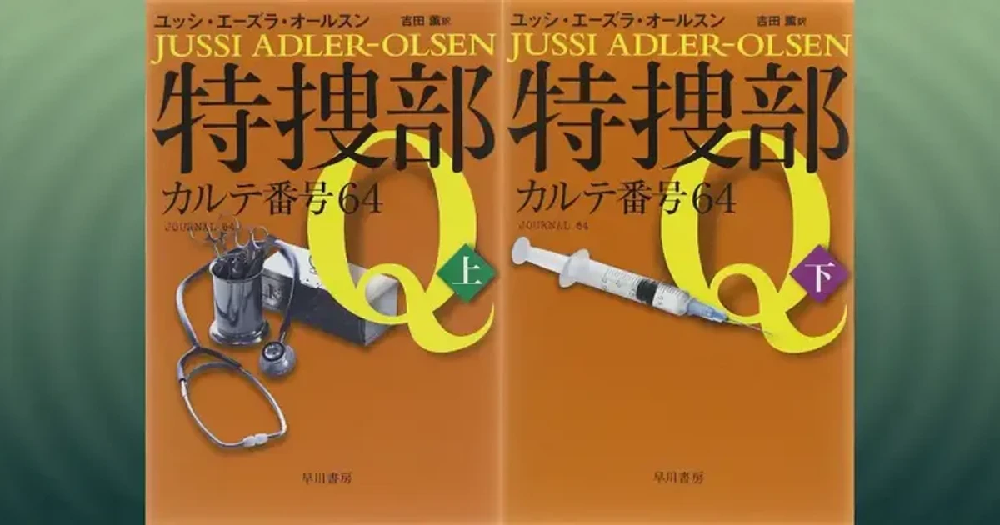

[:contents]

## あらすじ

> 未解決だった難事件を次々と解決、やっと日の目を見つつある特捜部Q。だが捜査を待つ事件は増えるばかりだ。そんななか、特捜部の紅一点ローセが掘り起こしてきたのは、20年以上前にエスコート・クラブの経営者リタが忽然と姿を消した奇妙な事件。しかもリタとほぼ同時に失踪した者が、他にも５人いることが判明し……。　デンマークの代表的文学賞「金の月桂樹」賞を受賞、ますます波に乗る大人気警察小説シリーズ第４弾！ 
> -- 本書より引用

## 読書感想

### 『特捜部Q―カルテ番号64―』の読みどころ

- デンマークを舞台に繰り広げる警察ミステリシリーズの第4作目。
- 個性豊かなメンバーの軽妙なやり取りと、深刻な事件とのコントラストが本シリーズの大きな魅力のひとつ。
- デンマークにかつて存在した女性収容所が物語の背景として描かれており、どこの国でも存在する優生思想について大きく考えさせられる作品。

### デンマーク発の警察ミステリ・シリーズ第四作

タイトルの「特捜部Q」は、デンマークにおける過去の未解決事件のみを対象に捜査を行う特殊な捜査部門である。コペンハーゲンのシティ署の地下にあるこの部署には個性的な面々がそろっており、彼らはそれぞれの強みを生かし、デンマークの闇に埋もれていた過去の事件を掘り起こしていく。

過去三作のいずれも素晴らしかったのだが、今作はこれまで以上に楽しめる作品となっている。

[https://www.neputa-note.net/2017/04/blog-post_23/:embed:cite]

[https://www.neputa-note.net/2017/06/q/:embed:cite]

[https://www.neputa-note.net/2017/11/jussi-adler-olsen-message-from-p/:embed:cite]

### シリーズならではの魅力について

ピンポイントで不幸を引き当てる才能に長けたニヒルなリーダー「カール・マーク」、謎多きアシスタントの「アサド」、多重人格の疑いがある同じくアシスタント「ローサ」、以上三名が特捜部Qのメンバである。

彼らのやり取りはこのシリーズにおけるお約束のようなもので、物語に安定感をもたらしている。

また特捜部Qが取り組む「未解決事件」とはつまり、解決に至らなかっただけの理由があるわけであり、いずれも難解かつ根が深い。これをうまいこと物語に展開できれば面白くないわけがない。

### 今作「カルテ番号64」の特徴

特筆すべきは、ストーリー展開が巧みになっていること、デンマークの闇ともいえる実在の出来事が背景にあることの二点ではなかろうか。

まずストーリー展開についてだが、過去の未解決事件を捜査するとはつまり、現在、過去の事件発生当時、そしてその事件を引き起こすにいたるさらに過去という3つの時間軸で構成されることとなる。

シリーズの第一作目からこの3つの時間軸による構成というのが行われている。今回の下巻以降は非常に練られた構成で展開しており、複雑怪奇な当事者たちの命運渦巻く物語の世界に、こちらをぐいぐいと引き込んでくる。

もうひとつの今作の背景となった実在の出来事とは、かつてデンマークには断種法があり、今作の舞台であるスプロー島に女性収容所が存在していたことである。

これはいわゆる優生思想にもとづき、女性を選別し断種措置を強制的に行ったというデンマークの黒歴史である。

### 優生思想についてもう少し

最近、日本でも「旧優生保護法」という悪法により犠牲となった人々の話がニュースとして報じられている。

[https://mainichi.jp/articles/20181217/k00/00m/040/188000c:embed:cite]

そして、国連が毎年発表する国別幸福度ランキング上位常連であるデンマークといえども、悪しき法により人を選別していた過去があったのだ。（ちなみにデンマークでは被害者への謝罪、補償は行われていないと著者が巻末で述べている。～本作出版時点～）

そこに人間の暮らし社会が存在する限り、ユートピアは存在しないということなのかもしれない。ただ、優生思想に限らず、人種間・国家間で起きた差別の行きつく先は戦争・紛争であることを歴史が証明している。

歴史は繰り返す、これは摂理であり避けることができない。とくに昨今は国家間で不寛容さをむき出しにする姿が目立つ。だが、じっさい人間に知恵があるというのならば、繰り返される悲劇は、以前に比べていくらか小さくなることを期待したい。それぐらいの希望がなければ生きていけない。

### 考えさせられる本作の主題について

今作の事件のきっかけは、時代と国家によって人生を切り刻まれてしまったニーデ・ローセンという女性による復讐劇である。だがこの復讐劇を生み出すそもそもの要因は、先に述べた優生思想による国家政策だ。

過去の作品にも増して救いようのない気持ちになる読後感であったが、誰しも避けることができないテーマを掲げた作品であり、とくに今の時代に読む価値は大きいと感じた一冊だった。

## 映像作品について

この「特捜部Qシリーズ」は映像化も順次されており、「カルテ番号64」もオンデマンド等で視聴することができる。

原作の世界観を損なうことなくうまいこと映画作品に仕立てており楽しめると思う。

## 著者・訳者について

> 著者　ユッシ・エーズラ・オールスン 
> 1950年、コペンハーゲン生まれ。10代後半から薬学や映画製作などを学び、出版業界などで働く。1985年からはコミックやコメディの研究書を執筆。その後フィクションに転じ、シリーズ第１作の『特捜部Q―檻の中の女―』（2007年）がベストセラーとなった。その後、2009年に発表したシリーズ第３作『特捜部Q―Pからのメッセージ―』で、北欧ミステリ賞の最高峰である「ガラスの鍵」賞を受賞している。シリーズ第４作の本書（2010年）は、デンマークの文学賞「金の月桂樹」賞を受賞した。 
> -- 本書より引用
<!-- -->
> 訳者　吉田薫 
> 関西大学文学部ドイツ文学科卒、英米文学・ドイツ文学翻訳家　訳書『特捜部Q―キジ殺し―』『特捜部Q―Pからのメッセージ―』エーズラ・オールスン（共訳）（以上早川書房刊）他。 
> -- 本書より引用
