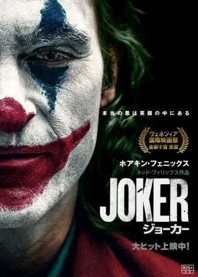

[:contents]

## 映画「ジョーカー」、先日ついに鑑賞

観終わったあと、わたしの足取りは軽く、頭の中ではなぜか時計仕掛けのオレンジバージョンの「雨に唄えば」が繰り返し流れていた。雨は降っていなかったが、傘を振り回しながらスキップでもかましてやろうかという気分だった。

## ベネチア国際映画祭での評価について

ほとんどの場合、目を付けていた作品が話題作になってしまうことを嫌う身勝手なわたしだが、ベネチア国際映画祭の金獅子賞の受賞はうれしかった。

わたしの強めの個人的偏見を述べると、今では成功し作品を評価する側にあり「持つ側」となった映像関係者というのは、もともとはどいつもこいつもそれはさまざまな感情をこじらせた連中だと思っている。

かつては命がけで作り上げた作品に石を投げられボロクソにこき下ろされるなんてこともあり、絶対に見返してやるとの執念を最後まで諦めることのなかった変態たちだ。つまり賞賛に値する人々だ。

そんなやつらが、持たざる側の人間が持つ側の人間に刃を向ける作品を評価したその一点のみにわたしは大いに喜んだのだ。もし無風であれば、映画界なんてもう永遠に終わりだぐらいにも思っていた。

まあこれは個人的な偏見と思い込みに過ぎない。

[https://eiga.com/news/20190909/8/:embed:cite]

## 事前情報に関する鑑賞後の感想

しかし実際に観に行くまで、この話題作の情報を避けるにはそれなりの苦労を要した。

好きで購読しているブログ記事も読まずにいたりするなか、どうしてもいくつかの記事は読んでしまったりする。

[https://www.cinra.net/article/column-201910-joker_gtmnmcl:embed:cite]

[https://toyokeizai.net/articles/-/308721:embed:cite]

どんな作品でも賛否両論はあるのだろうけれど、観終わっていま思うその両論のいくつかに思いを馳せた。

わたしは普段、不動産資産を持つ者と持たざる者の狭間に立つ仕事をしている。つまり不動産屋だ。賃貸物件を管理しマージンをかすめ取るお仕事だ。

資産を持つ側、賃料を払い借りる側、双方にクソ野郎が存在し、人格者もまたいる。

そしてふとわたしが思うことは、この同じクソ野郎の何が違ってこの現状があるのか、ということだ。考えても意味のないことを考えるのは好きじゃないが、生々しくその事実を突きつけられる場面が毎週のようにあるのだから仕方がない。

作品を見た多くが持たざる者だとわたしは決めつけている。わたしもその一人だ。「何をもって持つとか持たないとか言ってるんだお前は？」という問いは気にしない。強いて言うならば、生まれたときのスタートラインは雲の上じゃなかろうという話だ。ブルース・ウェインは天上界からのスタートだろう？

そこで先ほどの賛否両論についてだが、日頃おのれは普通の側だよな、いやどっちかつーと持つ側？などと、身の丈の真実と自己認識との間に隙間があるような者は、無意識層にひそむルサンチマンをチクチクっとされて不快になったりするかもしれんなと思った。

つまり、「KILL THE RICH」を掲げる連中に賞賛を浴び、美しく舞う男が主役として描かれるようなこの作品は、おのれのルサンチマン具合を試してくるな。これは見る前に何となく予測し、そしていまそうだったなとあらためて思うのだ。

そしてホアキン・フェニックスのインタビューはできれば我慢して読まずに見たかったなとすこし後悔している。笑い方とか鑑賞中にやっぱ意識しちゃったからな。

## 異径なるものへの憧憬

ふたたびいきなり自分を語るが、ここはわたしのブログだからいいのだ。 子どものころから人間ではないもの、とりわけ化け物に類するものへの憧れがある。

とりあえず思いつく限りで列挙してみると、妖怪人間ベム、デビルマン、ヘルシングのアーカードみたいなやつらだ。

そんなにアニメなどに詳しくないのがわかるラインナップだと思うが、人類から手放しで受け入れてもらえず対面すれば「化け物！」と言われてしまうような存在に憧れるのだ。

憧れの内訳としては、脆すぎる人間と違って出鱈目に強いという部分もそうだが、なにより、人間社会での共生を諦めざるを得ないほどに異径である存在にわたしもなりたいという逃避願望的な思いがもっともなところだ。

なんで突然そんなことを語りだしたかと言うと、この憧れの気持ちはいい年をした今でも十分に大きくあるのだなと、映画「ジョーカー」を見てあらためて気づかされちまったという話。

アーサーが髪を緑に染め、階段で舞いながら、異径なるもの「ジョーカー」へと変貌していく姿に著しく興奮した。なんかものすごく雄叫びたい！ヒョーとかフヒャーとかよくわかんないけど叫びだしたい感じで、いま思い返してみてもあーよかったなと思う次第。

それを味わいにもう1回ぐらいは観に行くかもな。

_Top photo by [Quentin Rey](https://unsplash.com/ja/@quentinreyphoto?utm_content=creditCopyText&utm_medium=referral&utm_source=unsplash) of [Unsplash](https://unsplash.com/ja/%E5%86%99%E7%9C%9F/%E3%82%B8%E3%83%A7%E3%83%BC%E3%82%AB%E3%83%BC%E3%82%AB%E3%83%BC%E3%83%89%E3%81%AE%E3%82%AF%E3%83%AD%E3%83%BC%E3%82%BA%E3%82%A2%E3%83%83%E3%83%97%E5%86%99%E7%9C%9F-Os1gNJtK_Rw?utm_content=creditCopyText&utm_medium=referral&utm_source=unsplash)_
