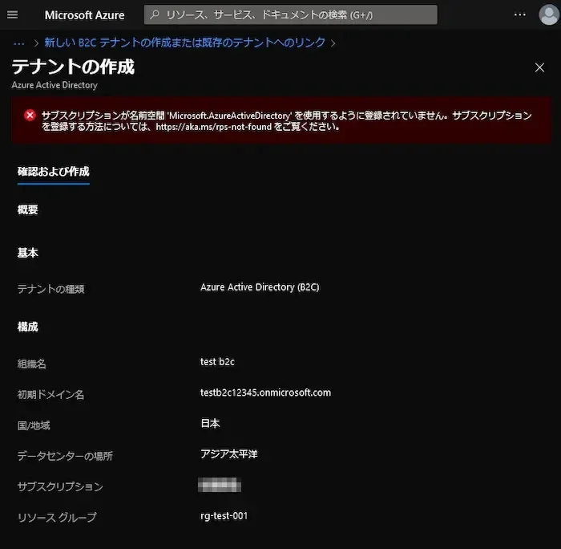
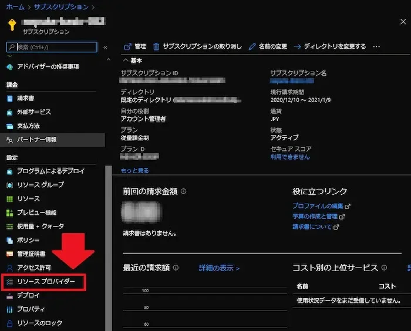
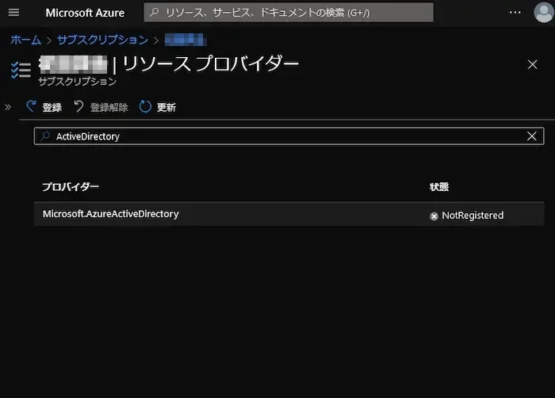
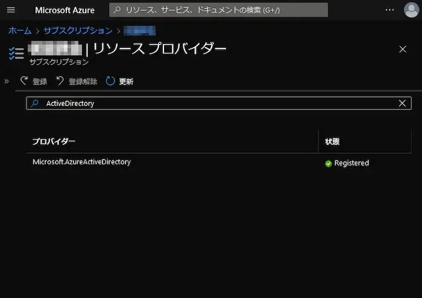

[:contents]

## 記事概要

Microsoft Azure ActiveDirectory B2Cの新規テナント作成時に発生したエラーの対処に関するメモ。

## エラーメッセージ

> サブスクリプションが名前空間 'Microsoft.AzureActiveDirectory'を使用するように登録されていません。サブスクリプションを登録する方法については、https://aka.ms/rps-not-foundをご覧ください。

## エラーの原因

サブスクリプションに名前空間「Microsoft.AzureActiveDirectory」が登録されていないため。

## 対処手順

1. 使用するサブスクリプションの概要ページを開く。
1. 画面左メニューの「設定」の「リソースプロバイダー」を開く。
   
1. 「Microsoft.AzureActiveDirectory」で表示されているプロバイダーをフィルタする。
   
1. 「Microsoft.AzureActiveDirectory」を選択し、「登録」をクリックする。
1. 状態が、「Registered」に更新されたら完了。
   

以上で冒頭のエラーは回避できる。
