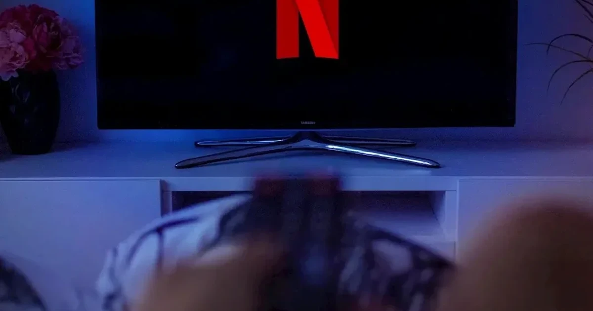
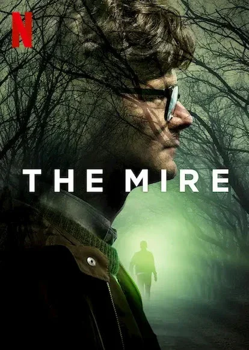
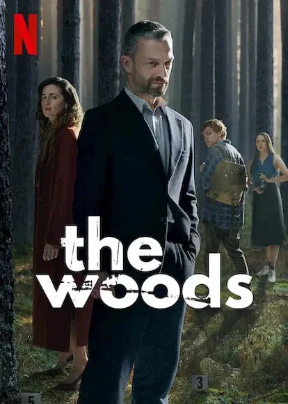
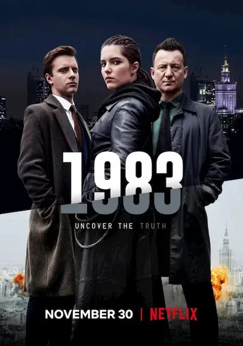
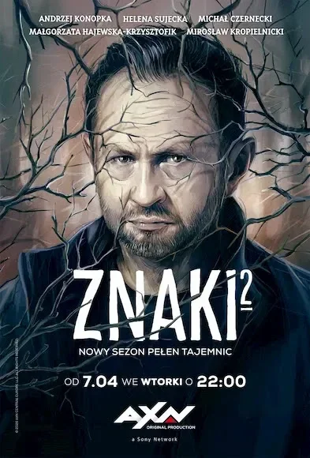
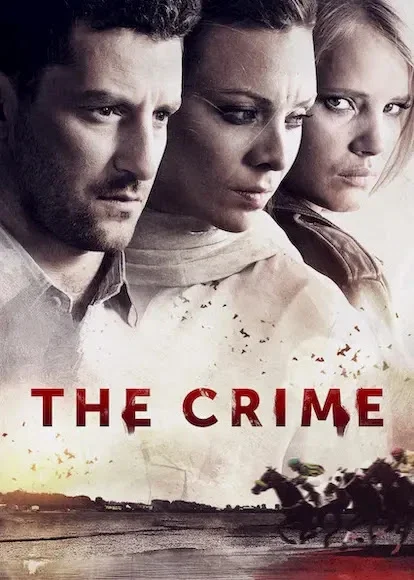

[:contents]

## さまざまな国の作品を視聴できる喜び

主に世界中の「ミステリ・サスペンス」にカテゴリされているドラマを視聴しています。

1か月1,320円（2020年11月時点）で、字幕付き（または吹替）のそれら作品を見ることができるなんてすごい時代です。

毎月のお布施の元を取らなければならない使命感にかられ、なるべく多くの国のドラマを見るようになりました。

最近では、制作国を軸に作品を楽しむなどということをしております。

そんなわけで、あるていど視聴履歴が溜まった国ごとに作品を紹介をし、「こんな視聴スタイルも楽しいよ」とお伝えしてみたくなりました。

初回は、Netflixで視聴した「ポーランド」のドラマ作品について簡単な紹介を書いてみたいと思います。

## ポーランドについて

過激な大統領により、近頃はいろいろと心配になるニュースを耳にするポーランドです。

[https://www.afpbb.com/articles/-/3312569?cx_part=top_category&amp%3Bcx_position=1:embed:cite]

[https://www.bbc.com/japanese/55327967:embed:cite]

国が違えば当然ながら法律や道徳感など多くが日本とは異なります。

ドラマを視聴しながらでも、その対象地域がどのようなところなのか知っておくとより楽しめたりします。

- [ポーランド基礎データ｜外務省](https://www.mofa.go.jp/mofaj/area/poland/data.html)
- [ポーランド - Wikipedia](https://ja.wikipedia.org/wiki/%E3%83%9D%E3%83%BC%E3%83%A9%E3%83%B3%E3%83%89)
- [Instytut Polski w Tokio](https://instytutpolski.pl/tokyo/)

また後述するドラマ作品の中に、戒厳令が解除された1983年をタイトルにしたものがあったり、会話の中で80年代はどんな暮らしをしていたという話しが出てきます。

[ポーランド人民共和国 - Wikipedia](https://ja.wikipedia.org/wiki/%E3%83%9D%E3%83%BC%E3%83%A9%E3%83%B3%E3%83%89%E4%BA%BA%E6%B0%91%E5%85%B1%E5%92%8C%E5%9B%BD#%E6%88%92%E5%8E%B3%E4%BB%A4)

近代史だけでも知っておくと、このあたりの背景が理解でき、よりドラマが面白くなると思います。

- [ポーランド／ポーランド人／ポーランド王国](https://www.y-history.net/appendix/wh0602-069.html)
- [ポーランドの歴史 - Wikipedia](https://ja.wikipedia.org/wiki/%E3%83%9D%E3%83%BC%E3%83%A9%E3%83%B3%E3%83%89%E3%81%AE%E6%AD%B4%E5%8F%B2)
- [7分で分かるポーランドの歴史！建国から社会主義脱却までの千年を総括 | ポーランドなび -WITAM!-](https://witam-pl.com/2016/11/14/blog256/)

## ポーランドのドラマ作品について

視聴しているのがミステリばかりなので、その他のタイプの作品では違うのかもしれません。

共通して、表情の変化やセリフが少ない！という印象を受けました。

ならばどうやって登場人物たちの気持ちを理解すればよいかとなると、その後の行動によってわかってくるわけです。

このような演出（習慣？）は、個人的に大好きです。

話しが反れますが、大好きな映画監督「アキ・カウリスマキ」の作品はこのような特徴が顕著です。

[https://www.neputa-note.net/2018/02/the-otherside-of-hope/:embed:cite]

その他の印象としては「しゃべるとき眉間にしわ寄る人多い」「みんなよくタバコ吸う」「水を飲み干すようにウォッカ飲む」といったところでしょうか。

視聴順に、これまでに見た作品を、なるべくネタバレせずに紹介してみたいと思います。

## ポーランドのミステリ・サスペンスドラマ５作品

※2020年11月時点

### 泥の沼 （原題：ROJST、英題：The Mire）

シーズン1のみ全6話

本作は、戒厳令がまだ敷かれていた80年代初頭のポーランド南西部の小さな町で、若い娼婦と地元の共産主義活動家が何者かに殺される事件で幕を開けます。

この残忍極まる事件の真相を解き明かそうと、地元の新聞社に務めるベテラン記者「ウィテク・ヴァニッツ」、若手記者「ピォトル・ザジツキ」の二人が挑みます。

大がかりなミステリ要素はありませんが、戒厳令下の特殊な状況で生きる人びとや町の様子が印象深い作品です。

タイトルの「泥の沼」は、実際の沼ではなく、事件に深入りし、泥沼にハマっていく様子を表現しているのでしょう。

また、国の体制や時代に関係なく、わるい奴も正義のためにたたかう勇者もいる。人間はどんな状況下でも人間だ、などと思ったりしました。

それにしても雰囲気と言い、音楽といい、アキ・カウリスマキを感じるのですよ。

### その森に （原題：W głębi lasu、英題：The Woods）

シーズン1のみ全6話

ひとつ前の「泥の沼」と同じ人が邦題をつけた説を推します。

1994年と25年後の2019年を舞台に、ワルシャワで検事を務める主人公「パヴェウ・コピンスキ」の物語を描いています。

この作品には2つの見どころがあります。

ひとつは、現在の事件が、25年前のサマーキャンプで起きた惨劇の真相につながるといったミステリ要素。

そしてもうひとつは、主人公のパヴェウをはじめとした同級生や家族が抱える苦悩の物語です。

後者の要素が個人的には魅かれるものがありました。

登場人物ひとりひとりに思い入れが深まっていく、短いながらも厚みを感じる作品です。

### 1983

シーズン1のみ全8話

この作品はSFですね。IFの世界です。

ポーランドの戒厳令は1983年に解かれ、その後民主主義国家へと歩んでいくというのが、現実世界の歴史です。

この作品は、1983年に共産主義が倒されず鉄のカーテンは敷かれたまま冷戦が継続した「IF」、その後のポーランドを描いています。

おそらく、二元論に囚われてしまっていてはまったく理解できない物語だと思います。

また、途中からでも近代史を簡単にでもおさらいしてみると、深みにはまることができます。

個人的には5作品の中で、というよりも、他の作品を比べてみても本作にどっぷりハマりました。

SFとヨーロッパ史に親しみのある人には余計に刺さると思います。

### サインズ （原題:Znaki、英題：Signs）

シーズン2各8話

ポーランドの閉鎖的な田舎町が舞台であり、この設定が作品の魅力でもある。

「閉鎖的な地方都市で起こる事件もの」というジャンルがあるかわかりませんが、この手の設定の作品はおもしろいものが多いと感じます。

法や道徳観がある程度無視された世界とでもいいましょうか。

その地域の人々の関係性により紡がれてきた独自のルールにより支配される世界がそこにはあり、そのよそ者が事件に挑むパターンですね。

本作ではひとり娘を持つ「トレラ」という男がこの町の警察署長として赴任し、殺人事件の捜査に挑みます。

何と言いますか、いい意味で突っ込みどころが多くて良い作品です。

カルトチックな集団、ナチスの謎の兵器、ズブズブの市長など、見どころはとにかくたくさんあって、本筋のミステリとともに楽しめました。

### ザ・クライム （原題:Zbrodnia、英題：The Crime）

シーズン2各3話

こちらは最近見たのですが、制作は2014-2015と少し前の作品です。

ポーランドの美しい海辺の町が舞台です。

ヘルという半島で死体が打ち上げられ、主人公の冴えない刑事とド新人のアシスタントが事件を捜査していく展開の物語。

小さな町の密なる人間関係の間で事件が起こる、これもまたよく見られるケースのミステリ作品だと思います。

これといった大きな特徴のある作品ではないと思います。

ポーランドに海があるのだなとか、泳げるんだなーとか、位置的に北極海？など色々ぼんやりと思いを巡らせながら観終えました。

少し凡庸に思える作品でも、見知らぬ土地の見知らぬ人々の物語というだけで、新鮮に楽しめたりするものですね。

## 最後に まとめ

簡単ではありますが、Netflixで見ることができるポーランドのミステリドラマ（2020年11月現在）を紹介してみました。

ミステリ作品では、必ず警察が登場します。

警察官や刑事たちを通じ、その国の体制が透けて見えます。

また、何かしらの事件にその地域や文化圏固有の特長が表れていることが多くあります。

こういった要素は見ていてとても新鮮ですし、また世界は広くさまざまな人が暮らしていることを再認識させてくれます。

このことは、たとえ娯楽であっても大切な体験なのかなと個人的には思っています。

どなたかのお役に立つかはわかりませんが、また次回、別の国で作品をまとめてみたいと思います。

長文・駄文しつれいしました！

_Top photo by [David Balev](https://unsplash.com/@davidbalev?utm_source=unsplash&utm_medium=referral&utm_content=creditCopyText) on [Unsplash](https://unsplash.com/s/photos/netflix?utm_source=unsplash&utm_medium=referral&utm_content=creditCopyText)_
