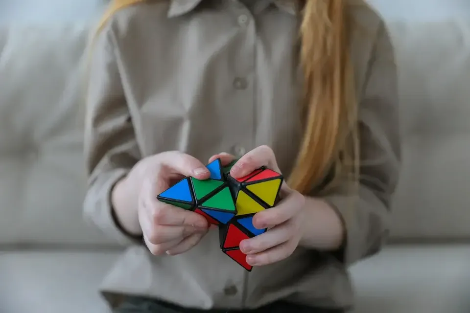

[:contents]

## 記事の概要

先日こちらに書いたことの詳細。

[https://www.neputa-note.net/2021/02/13/onethird-release:embed:cite]

インストールはこちらから。

> [!WARNING]
> Androidのみ iOS版は現在リリース未定

スマホアプリ開発未経験者が個人で開発からリリースするまでをの記録。

それなりのボリュームがあるため全7回に分けて書いてみたい。

1. 検討フェーズ（どんなアプリを作るか）【今回】
1. [要件フェーズ（どんな要件のアプリにするか）](/2021/03/01/first-mobile-app-02)
1. [調査フェーズ（どんな技術を使うか）](/2021/03/02/first-mobile-app-03)
1. [設計フェーズ（どうやって作るか）](/2021/03/03/first-mobile-app-04)
1. [開発フェーズ（実際に作りはじめる）](/2021/03/04/first-mobile-app-05)
1. [公開フェーズ（アプリを公開する）](/2021/03/05/first-mobile-app-06)
1. [保守フェーズ（公開から現在まで）](/2021/03/06/first-mobile-app-07)

ダイジェストで読みたい方はこちらの記事を。

[https://www.neputa-note.net/2021/02/13/onethird-release:embed:cite]

はじめてスマホアプリを作るにあたり、迷ったこと、どうやって解決したか、をできるだけ詳細に書いてみる。

拙いながらもどなたかの役に立てればうれしい。

今回は「検討フェーズ」でやったことをまとめていく。

## はじめてのスマホアプリ開発 検討フェーズ

### 「スマホアプリを作ってみたい」と思ったキッカケ

Photo by [Gabby K](https://www.pexels.com/ja-jp/@gabby-k?utm_content=attributionCopyText&utm_medium=referral&utm_source=pexels)

最初に思い立ったのは昨年2020年の6月ごろ。

COVID-19新型コロナウイルスの影響ですっかり生活様式が一変するなか、幸い私や近しいところで致命的な被害を受けることは無かった。

ただ閉塞感が増す状況下で精神的な疲労を感じ始めていた。

受け身一辺倒の生活はどうしても疲弊するもの。

多趣味だったりストレス解消の術があればいいが、これといったものがない。

何か没頭できることが必要だ。

寝食を忘れ取り組めることを始めたい、というのが一番のキッカケだった。

### なぜスマホアプリ？

Photo by [Pixabay](https://www.pexels.com/ja-jp/@pixabay?utm_content=attributionCopyText&utm_medium=referral&utm_source=pexels)

10年以上前、かつて仕事でプログラムを書いていたことがある。

と言っても、もともと理系の履修経験もなく、運よく採用してもらった会社の情シスで少々たしなんだ程度だが。

その後はまったく別業種へ転職し以降10年以上プログラムを書くこともなく過ごしてきた。

仕事ではあまりいい思い出はなかったが、プログラミングへの興味だけは残っていた。

技術関連の記事を眺めたりする程度のことはしていた。

そして「何か没頭できるものを」と考えたとき、過去に読んだ「スマホアプリを開発してみた」系の記事が頭に浮かんだ。

「何をどうすれば始められるのかもわからないけれど、とにかくやってみよう」、そんな気持ちでスタートを切った。

### 何を作ればいいか考える

Photo by [Pixabay](https://www.pexels.com/ja-jp/@pixabay?utm_content=attributionCopyText&utm_medium=referral&utm_source=pexels)

かつて関わっていたシステムは業務システム。

コンシューマ向けの開発は未経験、スマホアプリも未経験、調べなければならないことはたくさんありそう。

この時点ではやや怖気づいていた。

とはいえもっとも大事な「何を作るか」「何を作りたいか」が決まりさえすれば、あとはそれを実現する手段に過ぎないと謎の自信もあった。

いきなりにして最重要といえるのが「何を作るか」。

「作業量に圧倒されたり、行き詰ったりするたびにモチベーションを維持できるモノにしよう」というのがまず頭に浮かぶ。

どんなコトであれば、高いモチベーションを維持できるだろうか。

「誰かに喜んでもらえる」「めっちゃ儲かる」「世界が平和になる」、いろいろあると思う。

地味に地道に行きたい自分の性格的に「自分自身が日々使うもの」「できれば使い続けるメリットが自分自身にある」ことが重要と思い至った。

### 「睡眠記録アプリ」に決定する

Photo by [いらすとや](https://www.irasutoya.com/2018/11/blog-post_95.html)

私は長年「睡眠」という生活行動を苦手としてきた。

また、このブログの更新頻度やTwitterのツイート数からわかる通り、恒常的に何かをすることも苦手だ。

「睡眠を日々記録するアプリ」なら、この「2つの苦手」を克服する手助けになるのではないか。

将来的に天候や気温差などと併せて分析できたらいいな、など夢は膨らむ。

ということで、

- 自分で作ったアプリならば継続して使うだろう
- 自分で使うアプリだからいいものを作ろうと頑張れるだろう

この相乗効果を狙いに定め、まずは「睡眠を日々記録する」をサポートしてくれるアプリを作ってみることに決めた。

次回は「要件フェーズ」について書きたいと。

## はじめてスマホアプリを作ってみた 記事一覧

1. 検討フェーズ（どんなアプリを作るか）【今回】
1. [要件フェーズ（どんな要件のアプリにするか）](/2021/03/01/first-mobile-app-02)
1. [調査フェーズ（どんな技術を使うか）](/2021/03/02/first-mobile-app-03)
1. [設計フェーズ（どうやって作るか）](/2021/03/03/first-mobile-app-04)
1. [開発フェーズ（実際に作りはじめる）](/2021/03/04/first-mobile-app-05)
1. [公開フェーズ（アプリを公開する）](/2021/03/05/first-mobile-app-06)
1. [保守フェーズ（公開から現在まで）](/2021/03/06/first-mobile-app-07)
