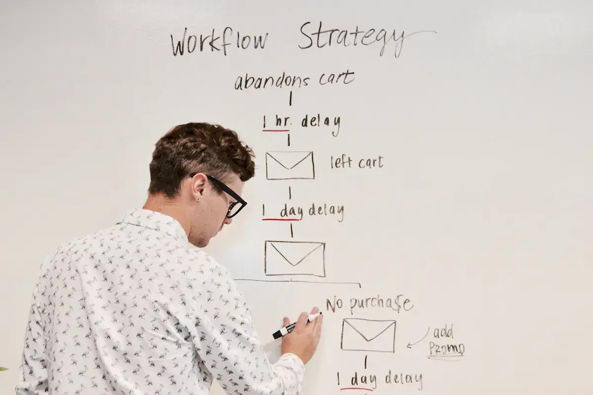

[:contents]

## 記事の概要

こちらの一覧の7つ目、「保守フェーズ（公開から現在まで）」の記事。

1. [検討フェーズ（どんなアプリを作るか）](/entry/2021/02/28/first-mobile-app-01)
2. [要件フェーズ（どんな要件のアプリにするか）](/entry/2021/03/01/first-mobile-app-02)
3. [調査フェーズ（どんな技術を使うか）](/entry/2021/03/02/first-mobile-app-03)
4. [設計フェーズ（どうやって作るか）](/entry/2021/03/first-mobile-app-04)
5. [開発フェーズ（実際に作りはじめる）](/entry/2021/03/04/first-mobile-app-05)
6. [公開フェーズ（アプリを公開する）](/entry/2021/03/05/first-mobile-app-06)
7. 保守フェーズ（公開から現在まで）【今回】

ダイジェストで読みたい方はこちらの記事を。

- [アラフォー初心者だけどスマホアプリを開発～リリースまでがんばってみた - neputa note](/entry/2021/02/13/onethird-release)

インストールはこちらから。

> [!WARNING]
> Androidのみ iOS版は現在リリース未定

## はじめてのスマホアプリ開発 保守フェーズ

[前回](/entry/2021/03/05/first-mobile-app-06)は、アプリをGooglePlayでリリースする工程をまとめた。

今回は、リリース後に見つけたバグや追加したい機能などをどのように管理し、実装しているかについて書いてみたい。

個人開発だから自分が把握できる方法であれば何でもよいとは思う。

こういうやり方してる人もいるんだ、という感じに温かい目で読んでもらえるとありがたい。

### 作業で使用しているツール

 _Photo by：<a href='https://unsplash.com/@toddquackenbush?utm_source=unsplash&utm_medium=referral&utm_content=creditCopyText' target='_blank'>Todd Quackenbush</a> in <a href='https://unsplash.com/photos/IClZBVw5W5A' target='_blank'>Unsplash</a>_

まずは使用しているツールについてを書いていく。

現在の作業環境を図に書き出してみ。

図中の各ツールをどのような目的で使用しているかを次にまとめる。

#### Visual Studio と Git

開発ツールは「Visual Studio Community」を使用。

[https://visualstudio.microsoft.com/ja/vs/community/:embed:cite]

ソース管理ツールの「Git」を操作する機能が統合されているため、作業時に起動するのはVisual Studioとブラウザのみ。

#### Azure DevOps

わたしの場合、記憶力に自信がないため1つ1つの作業を経緯を含めて記録しておく。後から見た際「なんのこっちゃ」となることが多いのだ。

この作業を記録するためにAzure DevOpsが大いに役立っている。

[https://azure.microsoft.com/ja-jp/products/devops/:embed:cite]

最初の5ユーザまでなら無料で利用できる。

Azure DevOpsで主に使用している機能は以下。

- Boards
  - 「Basic」「Agile」「Scrum」の3種類から管理方法を選択し、プロジェクト管理を行うことができる
  - 個人開発だが、分かりやすい情報が多かった「Scrum」を選択し使っている
- Repos
  - これはリモートリポジトリ（実質Github）
  - Visual Studioからpushしたコミットをここで管理する
- Wiki
  - アプリの仕様をここにまとめている
- Pipeline
- ビルドやデプロイを自動化するツール
- 現在は「App Center」を使っているため未使用

この他、「Test」という機能がある。有償プランでフルに利用できるようになる。

チーム開発であれば、Reposでテスト用のブランチを切り、Pipelineでビルド＆検証環境へリリース、Testでテスターが作業みたいな流れを実現できるのだと思われる。

#### App Center

Azure DevOpsで管理しているリポジトリを参照し、ビルド＆リリースを自動化できるツール。ブラウザから使用する。

[https://azure.microsoft.com/ja-jp/products/app-center/:embed:cite]

毎月のビルド数などに制限があるが無償で利用可能。

接続IDなどシークレット情報を管理し、ビルド時に差し込んでくれる機能などがある。

Azure DevOpsのReposにコミットを行い、App Centerが更新を検知して自動でビルド、Google Play Consoleへリリースするように設定している。

#### Google Play Console

Google Playの公開情報をここで管理する。

アップデートをApp Centerでリリースしたあと、審査中の間にここで多言語用のリリースノートを書いたりしている。

ダウンロード状況などを分析してくれる機能もあるが、ユーザも多くないため利用する機会はない。

#### Google Cloud Platform

App CenterからGoogle Play ConsoleへリリースできるようにAPI Serviceを提供してくれるプラットフォーム。

#### Azure

ユーザ認証の機能を提供してくれる「Azure AD B2C」、サーバDBとして利用しているドキュメントDB「CosmosDB」を使用している。

[https://cosmos.azure.com/try/:embed:cite]

[https://learn.microsoft.com/ja-jp/azure/active-directory-b2c/overview:embed:cite]

AWSの方が情報もユーザも多いとは思うが、.NET開発者向けの情報やライブラリが充実しているため、いまのところ不自由なく利用できている。

### 作業の流れ

 _Photo by：<a href='https://unsplash.com/@campaign_creators?utm_source=unsplash&utm_medium=referral&utm_content=creditCopyText' target='_blank'>Campaign Creators</a> in <a href='https://unsplash.com/photos/--kQ4tBklJI' target='_blank'>Unsplash</a>_

続いて、ここまで書いたツールをどのような手順で使用しているかについて書いていく。

1. Azure DevOpsのBoardsに、Bug・Product Backlog Itemを登録する（随時）
2. 優先度を整理し、次回リリース対象をBoardsのSprintsに登録する
3. Visual Studioで開発を行う
4. 作業内容をBoardsに記録する
5. 開発完了後、ローカルGitから、Azure DevOps ReposにPushする
6. Reposでmainブランチに開発ブランチをマージする
7. mainブランチの更新をApp Centerが検知し、Build → Distributeが行われる（自動）
8. App Centerから配布されたaabをGoogle Play Consoleが受け取りリリースが行われる（自動）
9. BoardsにCommit IDを記録しStatusをDoneにする
10. 一連の作業が完了

現在は、こんな感じで作業を繰り返しアプリのアップデートを行っている。

初回リリースをするまで、開発とこれらの環境構築を併せて行っていたため大変だった。

今はコーディングにもっとも時間を費やすことができる環境となっている。

## まとめ

ざっとではあるが、作業環境についてまとめてみた。

すべて我流のため、使い方がおかしかったりするものもあると思う。

わからない部分や、もっといい使い方がある、いいツールがあるよーなど指摘いただけるとうれしいかぎり。

10年以上前、かつて知っていた開発環境とは大きく変わり、今では便利なツールがたくさんあることに驚くとともに、ツールを作ってくれた方々に感謝しながら使わせていただいている。

いずれ費用を捻出できるぐらいになったら、有償のさまざまな機能も使ってみたいと夢見ている。

ここまで、初心者がはじめてスマホアプリを開発し、リリースするまでを7回に分けで書いてきた。

独学で実践し偏ったものかもしれないが、どなたかのお役に少しでもなればうれしい。

プログラミングはほんっとうに楽しい。

どうぞよき開発ライフを！

長文にお付合いいただき感謝！

### はじめてスマホアプリを作ってみた 記事一覧

1. [検討フェーズ（どんなアプリを作るか）](/entry/2021/02/28/first-mobile-app-01)
2. [要件フェーズ（どんな要件のアプリにするか）](/entry/2021/03/01/first-mobile-app-02)
3. [調査フェーズ（どんな技術を使うか）](/entry/2021/03/02/first-mobile-app-03)
4. [設計フェーズ（どうやって作るか）](/entry/2021/03/first-mobile-app-04)
5. [開発フェーズ（実際に作りはじめる）](/entry/2021/03/04/first-mobile-app-05)
6. [公開フェーズ（アプリを公開する）](/entry/2021/03/05/first-mobile-app-06)
7. 保守フェーズ（公開から現在まで）【今回】
