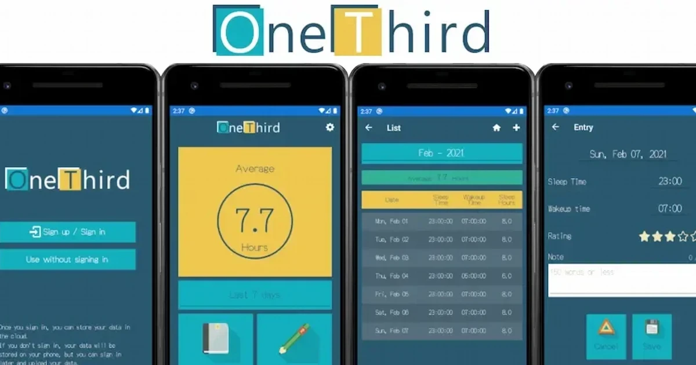

[:contents]

## 個人開発アプリ「OneThird」

個人開発で細々と、日々の睡眠を記録する「OneThird」というアプリを公開している。

[https://www.makuta-kobo.net/products/onethird/:embed:cite]

リリースから約1年経過し、これまで5回のバージョンアップを重ね、昨日6回目のアップデート版を公開した。

とくに目立った機能追加などはないが、このアプリをもっとも使用しているのが私であり、私がより使いやすくなるように更新を行っている。

しかし、今回の更新はサインアップ機能を持つがゆえにプライバシーポリシーを掲げているアプリプロバイダの義務として、ユーザが自分でアカウントを削除できる機能を実装するというもの。

それと同時に、ユーザには関係ないが内部的に気持ち悪い実装だった箇所のリファクタリングを行った。

[https://www.neputa-note.net/entry/2021/12/18/future-plans-for-mydev:embed:cite]

上記の記事に詳しく書いた。今回の追加機能であるユーザ削除において、結果的にアプリから「Azure AD B2C」のユーザ情報を操作するため「Azure Functions」によるAPIをかますことにしたのは、当初の予定としては不本意。だが、「サーバレス」の意味合いや、APIをはじめて作成するなど良い機会となった。

ひとつ気になるのは、利用者が少ない私のアプリだとしばらく稼働していない「Azure Functions」を最初に呼びだす際、レスポンスが遅い。結果、サインインが気になるレベルで時間がかかるようになってしまった。

これは次期課題としたい。

というわけで、毎日コツコツ睡眠記録をスマホで記録してみたい方はぜひ利用してみていただけるとありがたい。

