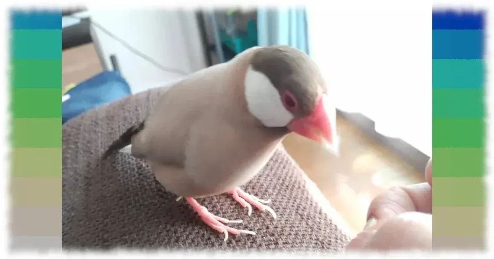

[:contents]

年末は一年を振り返る気分じゃないし、正月は新たな一年をあれこれ考える気分じゃない。日常が始まりようやく頭も回りだした。

過去を振り返ったり先を考えたりするのは年齢を重ねるにつれ億劫だ。
がんばれわたし、来年の自分のために。

## 2022年の振り返り

一年前は1月4日にこんな記事を書いた。

[https://www.neputa-note.net/entry/2022/01/04/my-goals-2021-2022:embed:cite]

### 2022年のやること、結果検証

2022年にやることとして挙げていたのは以下。それぞれの成果を検証する。

1. パートナーと文鳥さんの写真集をマンスリーベストショット方式で年末に作成する
2. 手話の勉強を始める（テキストを買う）
3. 読書時間を増やす（月2冊）
4. Duolingoドイツ語終わらせる（2024年まで）
5. 倫理を学ぶ（入門書を買う）
6. 骨髄バンクドナー登録

#### 【達成】パートナーと文鳥さんの写真集をマンスリーベストショット方式で年末に作成する

これは毎月末にパートナーと写真を選ぶ作業を続けてきた。

アルバムは「コイデカメラ」の「ソフトカバーA5」というサービスを利用することも決めた。

[ソフトカバーA5（写真仕上げ）- コイデカメラで写真プリント](https://www.koide.jp/service/photobook/in-store-photobook/soft/)

しかし、ベストショットが現在159枚ありさすがにもう少し絞り込む必要がある。

だがここで作業がとまっている。

あとは手元で行える作業なので今月中にはやろう。

1か月ぐらいの遅れはゆるそうや働きすぎ日本人。

ということでこれは達成。

#### 【未達】手話の勉強を始める（テキストを買う）

これは、2021年にパートナーと「共通の第二言語をもとう」という目的で始めたもの。

2021年は完全にサボり、そして2022年は「あ」から「ん」までを上半期コツコツやっていたのだが、下半期は完全にさぼった。

パートナーは順調に語彙を増やし成長しているが、わたしは丸二年かけて学習習慣の構築に失敗した。
今年はどうするか。

ドイツ語学習とどう両立するかをまじめに考えないとダメだとわかっているのでまずはその解決が上半期目標としよう。

下半期はそれが軌道に乗り日常化できたらいいぐらいが現実的だろう。
ということで2022年は未達。

#### 【未達】読書時間を増やす（月２冊）

視力が落ち、読書量が激減しているので何とか増やそうと立てた目標。
2022年の読書は以下のとおり。

- 1月
  - 前夜（ツチヤ タカユキ）
  - 三体Ⅲ　死神永生　上（劉慈欣）
- 2月
  - 三体III死神永生下（劉慈欣）
  - Blazor入門（増田智明）
- 3月
  - 物語ウクライナの歴史 ―ヨーロッパ最後の大国（黒川祐次）
  - カールの降誕祭（フェルディナント・フォン・シーラッハ）
  - ワン・モア（桜木紫乃）
- 4月
  - ユービック（フィリップ・K・ディック）
- 5月
  - 刑罰（フェルディナント・フォン・シーラッハ）
- 6月
  - 有罪答弁上（スコット・トゥロー）
- 7月
  - オカンといっしょ（ツチヤ タカユキ）
  - 有罪答弁下（スコット・トゥロー）
- 8月
  - 令和元年のテロリズム（磯部涼）
  - とんでもなく役に立つ数学（西成活裕）
  - 資本主義リアリズム（マーク・フィッシャー）
- 9月
  - くらしのアナキズム（松村圭一郎）
- 10月
  - ゼロ時間へ（アガサ・クリスティー）
- 11月
  - 自民党の統一教会汚染追跡3000日（鈴木エイト）
  - 忘れられた巨人（カズオ イシグロ）
- 12月
  - オリガ・モリソヴナの反語法（米原万里）

計20冊。みごとに目標は未達成。

視力の方は「乱視がひどいですねー」と眼科で診断を下され治療をしている。

読みたい本と積読は完全に来世と来々世でも足りないほどに増えている。

今年は少しでも視力が回復し、なるべく明るい時間帯に読書をすることで読書量を増やしたい。

ちなみにマンガはこれらを読んだ。

- ゴールデンカムイ
- クマ撃ちの女
- チェーザレ
- チェンソーマン
- 紛争でしたら八田まで
- BLUE GIANT EXPLORER
- ひらばのひと
- 運命の女の子
- チ。― 地球の運動について ―
- 現実逃避してたらボロボロになった話

ゴールデンカムイは最終巻に合わせて1巻から読み返した。

終わってしまったのだよな金カム。

物語の内容はもちろん、終わり方も初感覚の作品だった。

チェンソーマンはカラー版で楽しんだ。

登場する悪魔たちは、わたしの中にある受け入れがたい業であったり、社会であったり、この世界そのものだった。

読む人それぞれに異なるメタファーを感じるのだろう。

わたしは新井英樹の『ザ・ワールド・イズ・マイン』に似たカタルシスを感じるものだった。

『チ。』はまだ全巻読み終わっていないので今年の楽しみ。

その他は新刊を毎度買っている作品。

今年もどんなマンガに巡り合えるのか楽しみ。

#### 【未達】Duolingo ドイツ語終わらせる（2024年まで）

これは語学学習のスマホアプリでドイツ語勉強をやっているもの。

コロナ禍で色々きもちが不安になる中、没頭してしばし現実逃避できることとして始めた。

とりあえず毎日欠かさずやったが終わらなかった。

つまりこれは目標が甘かった。

やり続ける過程でDuolingo以外の角度からドイツ語に触れたいと思い始めたのが以下。

- ドイツ語の音楽を聞く
- ドイツ語学習のPodcastを購読
- ドイツ語文法の学習書籍を購入

音楽はYoutubeで「deutsch musik 2022」を検索し出てきたプレイリストを日常的に聴くようになった。

お気に入りは「257ers」というラップユニットと「Namika」というシンガーと「AnnenMayKantereit」というバンド。

[https://www.youtube.com/playlist?list=PLBBC5D9BBBD916641:embed:cite]

[https://www.youtube.com/@Namikamusik:embed:cite]

[https://www.youtube.com/@AnnenMayKantereit:embed:cite]

Podcastは「Vollmond」というオンラインドイツ語レッスンのサービスを行っているkomachiさんという方の配信を購読している。

[https://vollmond.online/:embed:cite]

Podcastで「ゲーテ（Goethe）」なるドイツ語資格を知った。

とりあえず始めたドイツ語学習だが、せっかくなので資格試験を目指してみようかなと思った一年だった。

結果としては未達。

#### 【未達】倫理を学ぶ（入門書を買う）

私は法治国家信者。

そして法の前にあるのが倫理哲学道徳だろう、ということでまじめに座学しようと思い立った。

キッカケはNHKのこのドラマ

[https://www.nhk.jp/p/rinri/ts/WKL8N2Z561/:embed:cite]

だがみごとに何も手をつけなかった、はい。

やった方がいい、絶対いい、と確信しているにもかかわらず、まったく見向きをしなかったことをよくよく顧みる必要がある。

新しいものに手を出す心理的余裕がなかったのかもしれない、といまふと思ったけど言い訳だな。

学ぶといいつつ読書でもあるので、とりあえず今月中に入門書を一冊買うべし。

完全未達ということで。

#### 【達成】骨髄バンクドナー登録

これは昨年始まって早々に実行した。

最寄りの赤十字献血センターに行き、検査を受けあっという間に完了した。

ほんの短時間で済むことだったのになぜこれまでやらなかったかと悔やんだ。

もしかしたら助かった命があったかもしれないと、ドナー登録することで強い実感が湧いたのだ。

未だ連絡はないが、適合する通知が来たら必ず提供する。

自分が患者になる可能性もある。

登録は簡単、短時間で済むので関心がある方はぜひドナー登録をしてみてほしいと思う次第。

[https://www.jmdp.or.jp/reg/:embed:cite]

#### やること振り返りのまとめ

結果としてはこんな感じ。

前年同様、2/6というヒドイ結果。

1. パートナーと文鳥さんの写真集をマンスリーベストショット方式で年末に作成する → 達成
2. 手話の勉強を始める（テキストを買う）→ 未達
3. 読書時間を増やす（月2冊）→ 未達
4. Duolingoドイツ語終わらせる（2024年まで）→ 未達
5. 倫理を学ぶ（入門書を買う）→ 未達
6. 骨髄バンクドナー登録 → 達成

目標の立て方が悪いのは確かだが、死ぬまでにやっておきたいことでもある。

一度外したり緩めたりすると、わたしの性質上、消滅しかねないので高めの設定で行くのは変えない方がいいと思ったりはする。

年々自分に甘くなっている気はするが、昨年はこれでも頑張った方と思うぞ、わたし。

とりあえず目標の結果検証は以上。

### その他やったこと

2022年の個人トピックスとして記録しておきたいことなど。

#### 観に行ったもの

生まれてはじめてお笑いライブに行った年でもあった。

見たのは2本。

1つ目は、真空ジェシカ×吉住ツーマンライブ「GATSUMORI」。

2つ目は、Dr。ハインリッヒ単独ライブ『原液、形而上学』。

Dr。ハインリッヒの方は記事も書いた。

[https://www.neputa-note.net/entry/2022/10/09/dr-heinrich:embed:cite]

その他、映画館は『ジュラシック・ワールド　新たなる支配者』と『犬王』だけだった。

来年はもっと映画館行こう。

#### Netflix（映画）

映画館に行く機会が減ったのはコロナ禍もあるがNetflixがもっとも大きな理由だ。

2022年も素晴らしい作品にたくさん出会うことができた。

#### Netflix（ドラマ）

わたしにとって一番の時間泥棒はNetflixのドラマ。

以前のように一気観はせず、最近は夕飯後に1～2話ずつ見るようになったとはいえ累積時間はかなりのもの。

とくに面白かった作品は記事を書いたりつぶやいたりしていた。

全部見てノーリアクションの作品もあるので費やした時間は相当なものだろう。

わたしにとって数少ない娯楽なので無理に減らすことはしないけども。

[https://www.neputa-note.net/entry/2022/06/25/you:embed:cite]

## 2023年にやること

今年は昨年達成した2つを入れ替えた以下6つを目標に生きる。

1. 手話の勉強を始める（テキストを買う）
2. 読書時間を増やす（月2冊以上）
3. ドイツ語資格試験「ゲーテA1」相当のレベルに達する
4. 倫理を学ぶ（入門書を買う）
5. スマホアプリのアップデートをする
6. 勤務先の基幹システム設計に着手する

### 各目標の詳細

#### 手話の勉強を始める（テキストを買う）

今月中に買う。とりあえず買う。そして毎日すこしでも手話に接する方法を考える。

ラジオ、Podcastと聴くメディアを好むわたしにとって、視覚でコミュニケーションを取る言語を学ぶことはかなり工夫が必要だと分かっている。

パートナーがどんどん習得しているので頑張ろうという気持ちは強い。

まずは一歩を今月中に踏み出す。

#### 読書時間を増やす（月２冊）

視力を解決できないかぎりは、できるだけ朝、あるいは昼に読書時間を設けるしかない。

読みたい本はたくさんあるし増えていく一方なので朝15分、できれば30分ぐらい読書する習慣を身につけるべし。

あとオンライン上で読書会をしている人たちのところに勇気を出して参加することも本気で考えてみようと思う。

#### ドイツ語資格試験「ゲーテA1」相当のレベルに達する

これはドイツの国が主催している資格試験であり、世界で通用するものらしい。

[Goethe-Zertifikat A1: Start Deutsch 1 - Goethe-Institut Japan](https://www.goethe.de/ins/jp/ja/spr/prf/gzsd1.cfm)

年初に行われるので今年は無理だ。

なので今年いっぱいで合格できるレベルまで学習し、2024年の申し込みを今年の年末にするところまでを目標にがんばる。

Duolingoは語彙を増やす目的で継続し、文法を解説書で体系的に叩き込むべし。

そして試験問題集を買って、これまでの学習を形にしたい。

そしてフェルディナント・フォン・シーラッハの原書を読めるようになりたい。

#### 倫理を学ぶ（入門書を買う）

これも、今月中に良さげな一冊を探して買う。

今月中、手元に置く。

目立つところに置く。

すべてはそれからの話しだ。

#### スマホアプリのアップデートをする

以前、個人開発した睡眠記録をつけるスマホアプリがある。

[https://www.neputa-note.net/entry/2021/02/13/onethird-release:embed:cite]

開発で使用していたフレームワークが大きく変わる（Xamarin.formsからMAUIへ）ため、そのあとにやろうと先延ばししているうちに2022年はまったくやらなかった。

プログラミングは好きなので、目標に加えずともやるだろうと思ったらこれだ。

わたしはわたしという人間を甘く見過ぎていた。

今年はやろう。

まずはMAUIのチュートリアルでどんなもんか確認し、移行作業を年内目標でやる。

#### 勤務先の基幹システム設計に着手する

仕事のことはプライベートの個人目標とは別と思っている。

勤務先は高齢のワンマン社長の信念にもとづき紙とFAXがスタメンを張っている。

そして、関連会社との関係でどうしても必要なITインフラをわたしが全部やるという体制。

だが社長の年齢を考慮し、いつでも社長が手を止めてもシステムでフォローできるカタチにしないと、とずっと思っているがずるずる先延ばしてきた。

予算をもらって職場でやろうにもお元気なうちは首を縦に振ることはないだろう。

なので、趣味もかねて個人的にやろう、そろそろ準備を開始しようと思った次第。

業務の種類・量ともにそう多くはない。

いま一度業務設計をし、要件をまとめるところまでやる。

がんばれ、わたし。

## さいごに

21世紀も20世紀と変わらない。

世紀の初めにデカい戦争するのが人類なのだと思い知り愕然とした2022年だった。

今年はどうなるかなんて今の時点ではあまり明るく考えることはできないけれど、昨年同様とりあえずやれることをやって生きていこう。

家族であるパートナーと文鳥さんと共に。
