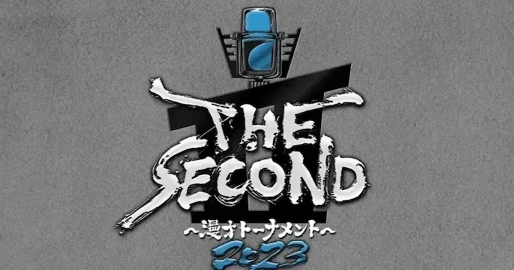

_Photo by : [お笑いナタリー](https://natalie.mu/owarai/gallery/news/525392/2048621)_

[:contents]

## 概要

M-1グランプリ（以降、M-1）で優勝経験が無く、出場資格である結成15年を越えたコンビ＆グループのみが参加できる漫才師による大会「THE SECOND 〜漫才トーナメント〜」（以降、THE SECOND）について語る。

THE SECONDの参加資格はM-1グランプリと排他の関係である。

つまり、数ある漫才師の大会において最高権威として君臨するM-1のカウンターとして立ち上がった企画であることが透けて見える。

よって個人的な楽しみ要素としては、

- 大好きな金属バットが土曜ゴールデン地上波で漫才することを祝う。
- 漫才キングダムM-1との相違を観測する。

これである。

## 金属バットについて

第1回から毎週「金属バットの声流電刹」を拝聴し、昨年のラストイヤーはM-1決勝行くだろうと思いきや準決勝直前でコロナ罹患というドラマを経た経緯がある。

キラキラ地上波ゴールデンであってもお構いなし。

劇場での空気そのまま最高の漫才を見ることができ感無量だった。

そして、松本人志の「やっと見れて感動した」のひと言がさらに花を添えた。

この時点で9割は満足することができた。

## 「THE SECOND」と「M-1」の相違について

M-1グランプリにおける象徴は「審査員席」だと思っている。

あれがお笑い権威として君臨し、全漫才師はあの権威に向かって全力で漫才をし、報われた者たちは人生を変えることに成功する。

これは否定や批判ではない。

THE SECONDには「審査員席」がない。

権威は解体され、観客席にいる我々と同じ一般市民が「おもろい」を決めるのだ。

笑いの決定権の委譲である。

国民国家形成以降の人類史と同じ現象がここにも出現したのだ。

そして権威オブ権威の松本人志は、番組を盛り上げる一人「まっちゃん」としてこの輪に加わった。

出場した漫才師と軽快に絡み、そしてボケて時にツッコむ。

ルールー上、避けることができない勝負の決定において、敗者へ向けるまっちゃんのまなざしはとにかく優しかった。

これまで観覧の一般客は笑い声を発することのみを求められる装置であった。

笑いの民主化は私たちに意志があることの可視化をもたらす。

かつての審査員同様、私たちにもおもろいの基準があり、得手不得手はともかくそれを言語化し伝えたい意志がある。

THE SECONDはこの意志の存在を番組に必要な要素として採用している。

まっちゃんが懸念を示したマシンガンズのメモ用紙を市民が受け入れた場面はそのハイライトのひとつではないか。

ついでに決勝のマシンガンズは漫才師とは人間であることをこれ以上ない形で表現していた。

歴史が証明しているとおり、意志的な参加者が多ければ多いほど熱狂は高まる。

そして熱狂は奇跡を演出するに不可欠な要素である。

まっちゃんが元気玉ならぬ笑い玉と評したギャロップのあれ。

4分のフリで宇宙スケールに拡張した渾身のボケという名の笑い玉は、熱狂の頂点にある私たちを恍惚へと導いたのだった。

4時間という長丁場であったが、制作、演者、観覧者、視聴者すべての関係した者たちがフラットに関係することができる新たな文化の萌芽を感じる体験だった。

繰り返すが、M-1との相違に着目したのは否定や批判が目的ではない。

THE SECONDが良かったからM-1は駄目だと思考するのは愚かである。

漫才師の魅力を全国へ広げるためにM-1の歴史は欠かせないものであったであろう。

また新たな試みが権威を崩すプロセスは拡張および継続に欠かせない。

伝統芸能に片足を突っ込みつつある漫才が、また新たに裾野を広げていくことはファンにとってこれ以上ない喜びであると信じている。

> [!NOTE]
> 追記：2023/05/23

マシンガンズのメモ用紙の箇所について、採点後にまっちゃんの指摘がされたのは正確なところであり、私の指摘は誤りであった。訂正ないし削除を考えたが、誤った記載をした事実と後から気づいた事実を併記しておくことが「記録」として価値があると考えこの形とした。

[https://news.yahoo.co.jp/expert/articles/b25e8d742ab1f9fff8b1277ec592d87067f7e388:embed:cite]

## 余談：しゃべくり漫才の熟成について

参加資格を結成15年とするM-1グランプリにおいて、新たな発明を得意とするいわゆる関東芸人が有利な傾向を感じている。

また傾向対策により競技ハックが常識となりつつある。

今回のTHE SECONDを見て、しゃべくり漫才というものは、15年では成熟しない芸能であることを改めて思った。

キャラ要素を排し、板の上で人生を土台に笑かす芸は15年じゃ短すぎるのかもしれない。

予選もそうだったか、今大会に参加した漫才師はいずれも分厚かった。

そして、その分厚さはしゃべくり漫才において欠かせない。

生涯をたすける芸でありながらM-1では支えきれなくなってきたしゃべくり漫才の新たな基盤としてTHE SECONDが続いていくことを願う。
