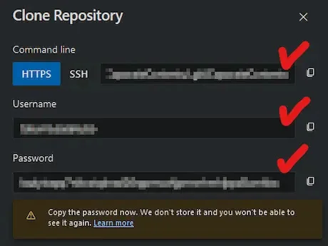
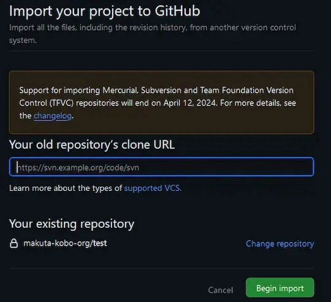
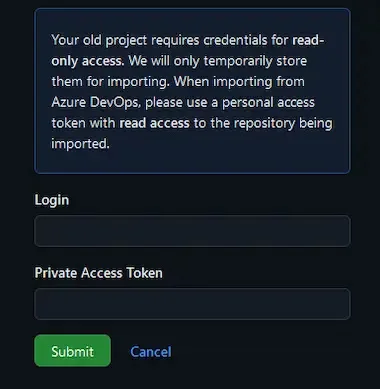

[:contents]

## 記事概要

Azure DevOpsで管理しているリポジトリをgithub側で使いたいと思い、マイグレーション、クローンなどで手段を探してた。

Azure DevOps側で一時的なクレデンシャルを発行し、github側からインポートするやり方を見つけた。

Github側からAzure DevOpsのリポジトリをインポートする手順について備忘録。

## 作業詳細

Githubにインポート先のリポジトリを作成しておく。

Azure DevOpsのリポジトリを開き、「Clone」ボタンをクリックする。

「Generate Git Credentials」をクリックする。

HTTPSのURL、Username、Passwordを控えておく。

Githubのリポジトリ画面を開き、最下部「...or import code from another repository」の「Import code」ボタンをクリックする。

「Your old repository's clone URL」にAzure DevOpsで取得したURLを入力し、「Begin
import」ボタンをクリックする。

「Login」と「Private Access Token」にAzure DevOpsで取得したUsernameとPasswordを入力し、「Submit」ボタンをクリックする。

以上。

## 参考記事

[Migrating an Azure DevOps Repo to GitHub - Trailhead Technology Partners](https://trailheadtechnology.com/migrating-an-azure-devops-repo-to-github/)
