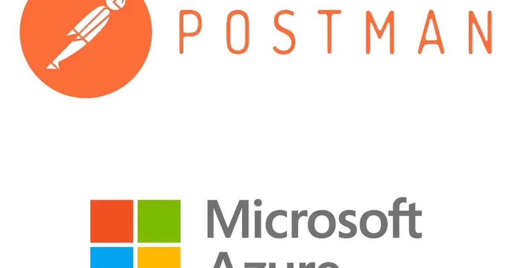

[:contents]

## 記事の概要

個人でモバイルアプリを作っている。 認証機能としてMicrosoftのAzure Active Directory B2C（以降、B2C）を利用している。

B2Cの認証を介してバックエンドのWeb APIを叩けるようにしたい。 そこで、このWeb APIを開発するにあたり、Postmanを使って動作を確認したかったりする。

環境はあるとのこと。

[Azure Active Directory B2C を使用して Azure API Management API をセキュリティで保護する | Microsoft Learn](https://learn.microsoft.com/ja-jp/azure/active-directory-b2c/secure-api-management?tabs=app-reg-ga)

Postman上の設定で手こずったので備忘録を残す。これが本記事の主題。

## 前提条件

- B2CにWebAPIおよびクライアントアプリを登録済みであること
- PostmanはWindows版のバージョン10.20.7

## Postmanの設定

- 画面上部中央、検索窓で「Microsoft Graph」のCollectionsを検索（公式の青バッジがついてるやつ）
- それをPostman上でFolkする
- My Workspace→Microsoft Graphを選択する
- VariablesにB2Cに登録したクライアントアプリの「ClientID」を登録
- My Workspace→Microsoft Graph→Delegatedを選択し、Authorizationタブを開き以下のとおり設定

| 項目 | 値 |
| --- | --- |
| Type | OAuth 2.0 |
| Add auth data to | Request Headers |
| Token | デフォルトのまま |
| Header Prefix | Bearer |
| Auto-referesh Token | オフ |
| Share Token | オフ |
| Token Name | 任意の名称 |
| Grant type | Authorization Code (With PKCE) |
| Callback URL | `https://oauth.pstmn.io/v1/callback` B2Cに登録したクライアントアプリのリダイレクトにこの値を保存しておくこと |
| Authorize using browser | オフ |
| Auth URL | `https://[テナント名].b2clogin.com/[テナント名].onmicrosoft.com/[サインイン ユーザー フロー]/oauth2/v2.0/authorize` |
| Access Token URL | `https://[テナント名].b2clogin.com/[テナント名].onmicrosoft.com/[サインイン ユーザー フロー]/oauth2/v2.0/authorize` |
| Client ID | `{{ClientID}}`   (Valiablesに登録した値を呼びだす変数) |
| Client Secret | 空欄 |
| Code Challenge Method | SHA-256 |
| Code Verifier | 空欄 |
| Scope | openid offline_access `https://[テナント名].onmicrosoft.com/api/access_as_user` 3つ目のURLはB2Cに登録した「APIの公開」に設定したもの |
| State | 空欄 |
| Client Authentication | Send client credentials in body |

以降はデフォルトまま。

これで、最下部の「Get New Access Token」ボタンよりインタラクティブに認証を行いAccess Tokenをゲットする。

以上
