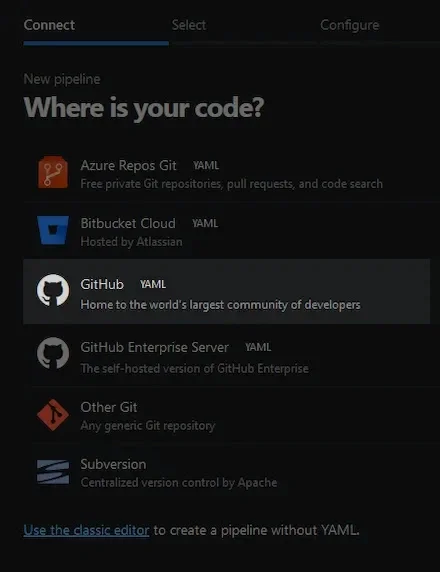
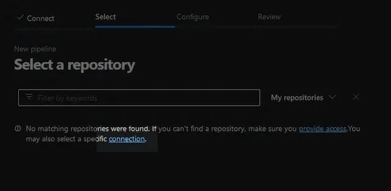
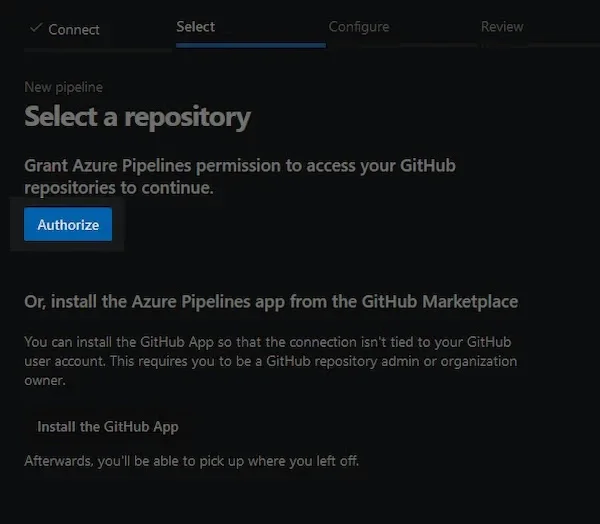
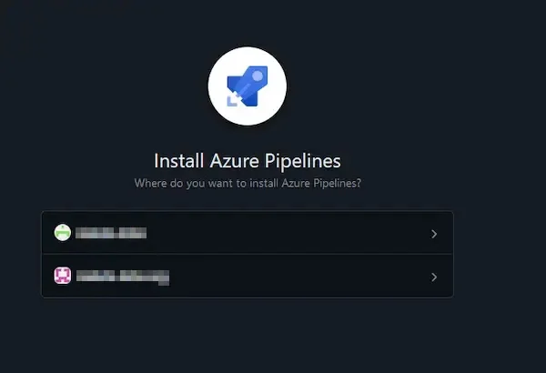
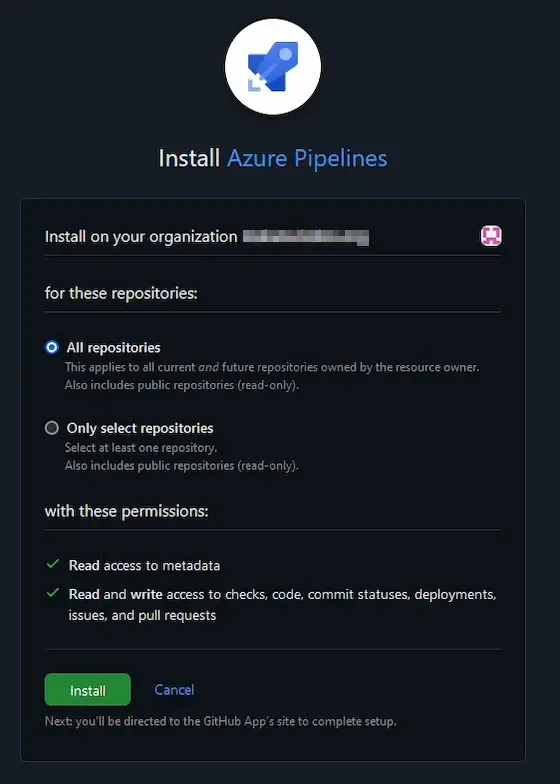
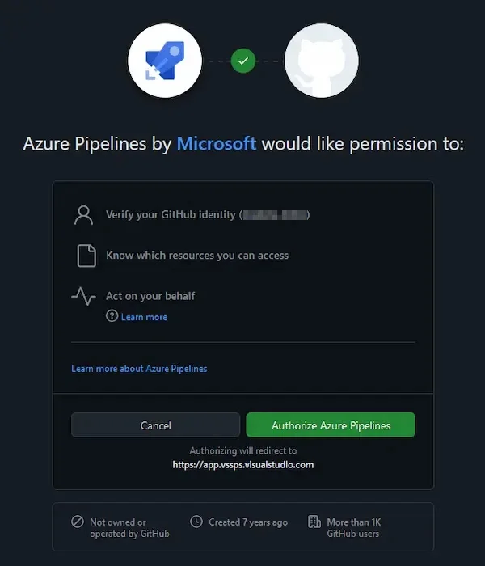
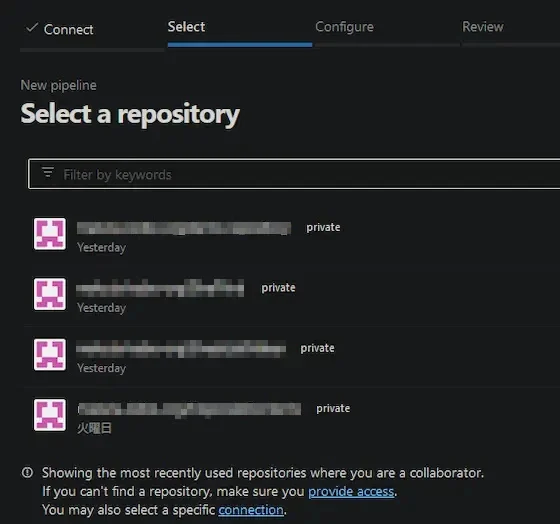

[:contents]

## 記事概要

AzureDevOpsのPipelinesにおいて、Github Organizationsのリポジトリを参照する設定作業の備忘録。

## 前提条件

- AzureDevOps、Githubそれぞれのアカウントがある
- GithubにOrganizationsが登録されているかつリポジトリが存在する
- GithubアカウントがOrganizationsに所属かつリポジトリ参照権限がある

## 作業詳細

「New Pipeline」からリポジトリ選択画面「Where is your code?」を表示し、「Github」を選択する。

Githubアカウントの認証を行う。

認証が通ると該当アカウントのリポジトリが表示されるが、組織のリポジトリは表示されない。

ここで「connection」のリンクをクリックする。

「Authorize」ボタンが表示されるのでクリックする。

先ほど認証を行ったGithubアカウントと、所属するGithub Organizationsが表示される。

該当するOrganizationsを選択する。

全リポジトリまたは特定のリポジトリとするかを選択し、「Install」をクリックする。

Github側にAzure Pipelinesを認証することの許可を聞いてくるので「Authorize Azure Pipelines」をクリックする。

Github Organizationsのリポジトリが表示される。

## 参考記事

[Creating a service connection for a GitHub Organization in Azure DevOps – DevOps Nights – Improving the value delivered with DevOps](http://blog.devopsnights.io/Creating-a-service-connection-for-a-GitHub-Organization-in-Azure-DevOps/)
