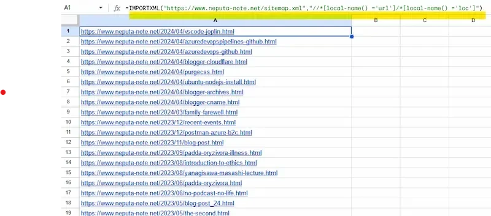

[:contents]

## 本記事の概要

Googleスプレッドシートの関数のひとつ、「IMPORTXML関数」についての備忘録。

HTMLファイルのスクレイピングの記事はたくさん見つかるが、XMLファイルをターゲットにした情報が少なかったのでメモを残す。

## GoogleスプレッドシートのIMPORTXML関数

[IMPORTXML - Google ドキュメント エディタ ヘルプ](https://support.google.com/docs/answer/3093342?hl=ja)

HTMLスクレイピングの記事が山ほど見つかるが、XMLファイルを扱う記事は少ない。

たとえばこのブログのサイトマップを対象に実行する。

sitemap.xmlのスキーマは以下のとおり。

```xml
<?xml version='1.0' encoding='UTF-8'?>
<urlset xmlns="http://www.sitemaps.org/schemas/sitemap/0.9">
  <url>
    <loc></loc>
    <lastmod></lastmod>
  </url>
</urlset>
```

今回はURLの一覧を作るため「loc」タグのみを取得したい。htmlと同様、「//loc」とやれば良いかと思いきやエラーとなる。

XMLの場合、HTMLとはXPathの指定が異なる。

正解はこれ。

```xml
//*[local-name() ='url']/*[local-name() ='loc']
```

XPathはこのサイトで検証できる。

[Online XPath Tester and Evaluator](https://extendsclass.com/xpath-tester.html)

実際のIMPORTXML関数はこんな感じ。

```log
=IMPORTXML("https://www.neputa-note.net/sitemap.xml","//*[local-name() ='url']/*[local-name() ='loc']")
```

実行結果



以上

## 参考記事

[How to Extract URLs from a Sitemap Using Google Sheets - Aubrey Yung](https://aubreyyung.com/extract-urls-from-sitemap/?utm_source=pocket_saves)
