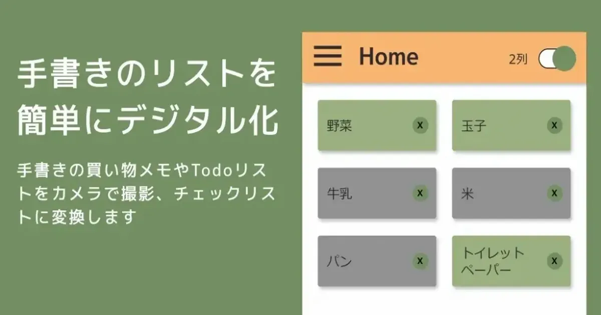

[:contents]

## この記事の概要

個人でスマホアプリを開発している。手書きで書かれたメモをカメラで撮影すると自動でチェックリストが生成されるアプリ。我が家は必要なものがあると小さなホワイトボードに随時書き込み、買い物時これを撮影し、現地でチェックリストとして活用する。

今回、履歴機能を追加したので使用した技術に関する備忘録を記す。

## アプリについて

「CheckListMaker」というアプリ。

以下からインストールできる。（現在Android版のみ）

使い方の詳細はこちらのページを参照。

[About CheckListMaker — MakutaKobo](https://www.makuta-kobo.net/products/checklistmaker/)

過去に作成したアプリ

[OneThird : シンプルな睡眠記録アプリ - Google Play のアプリ](https://play.google.com/store/apps/details?id=com.neputafactory.onethird)

## 使用した技術

### 開発環境

- OS: Windows 11 Pro
- IDE: Visual Studio 2022 Community

### 言語・フレームワーク

- 言語： C#
- Framework: .NET MAUI 8.0
- NuGet Packages
  - CommunityToolkit.Maui
  - CommunityToolkit.Mvvm
  - Microsoft.Azure.CognitiveServices.Vision.ComputerVision
  - Plugin.MauiMTAdmob
  - LiteDB

### クラウドサービス

- Azure AI Vision（OCR解析）

### .NET MAUIについて

- [.NET MAUI とは - .NET MAUI | Microsoft Learn](https://learn.microsoft.com/ja-jp/dotnet/maui/what-is-maui?view=net-maui-8.0)

## 本題

これまで生成したチェックリストは都度Jsonファイルに保存するものの、新しいチェックリストを作成すると上書きし、以前のリストは残らない仕様としていた。

だが使っていて頻度は少ないものの、以前のメモを参照したいケースがあったため、今回履歴機能を追加することとした。

といっても、せいぜい直近10件ぐらいが保存されていればいいのでアプリが重くなるDBなどは使いたくない。かといってJsonよりは使い勝手がよいとうれしい。

そこで見知ったのが「LiteDB」。

[https://www.litedb.org/:embed:cite]

> LiteDBは、小型、高速、軽量の.NET NoSQL組み込みデータベースです。 
> ・サーバーレスNoSQLドキュメントストア 
> ・MongoDBに似たシンプルなAPI 
> ・単一のDLLで.NET 4.5 / NETStandard 1.3/2.0に対応する100% C#コード（450kb未満） 
> ・スレッドセーフ 
> ・トランザクションを完全にサポートするACID 
> ・書き込み失敗後のデータ復旧（WALログファイル） 
> ・DES (AES)暗号を使用したデータファイルの暗号化 
> ・属性または流暢なマッパーAPIを使用してPOCOクラスをBsonDocumentにマッピング 
> ・ファイルとストリームデータの保存（MongoDBのGridFSのようなもの） 
> ・単一のデータ・ファイル・ストレージ（SQLiteのような） 
> ・高速検索のためのドキュメントフィールドのインデックス 
> ・クエリのLINQサポート 
> ・SQLライクなコマンドによるデータへのアクセス/変換 
> ・LiteDB Studio - データアクセスのための優れたUI 
> ・オープンソースで誰でも無料で利用可能 - 商用利用も可能 
> ・NuGetからインストールします： Install-Package LiteDB 
> -- [mbdavid/LiteDB: LiteDB](https://github.com/mbdavid/LiteDB)より引用を[DeepL](https://www.deepl.com/ja/translator)で翻訳

特に良いと思った点は、軽量（450kb未満）であること。そして、C#で記述したモデルクラスを、日付型のミリ秒が3桁までしか保存されていないなど、完全ではないが、 ほぼそのまま保存できること。

公式ドキュメントにサンプルコードがあるが、非常にシンプルなコードで利用できる点も良き。

[Getting Started - LiteDB :: A .NET embedded NoSQL database](https://www.litedb.org/docs/getting-started/)

プラットフォームを選ばず利用できる。

.NET MAUIであれば、FileSystem.Current.AppDataDirectory + fileName にDBファイルを配置して使用する。

ファイル名は、.db拡張子。

今回は、LiteDBを操作するサービスクラスを作成し、履歴管理を行う機能としてアプリに組み込んだ。

ソースは公開しているのでご参考まで。

[CheckListMaker/CheckListMaker](https://github.com/makuta-kobo-org/CheckListMaker/tree/main/CheckListMaker)

.NET向けのためユーザは少なそうだがGithubにサンプルは結構見つかる。

## まとめ

以前作った睡眠記録アプリでは、[Realm Mobile Database](https://www.globallogic.com/insights/blogs/realm-a-mobile-first-database/)というDBを使用していた。

LiteDBはより軽量で、ORマッパーいらずでシンプルに使える。モバイルアプリなど簡単なデータ管理で軽量さを求めるのであれば最適と思った次第。

以上。
