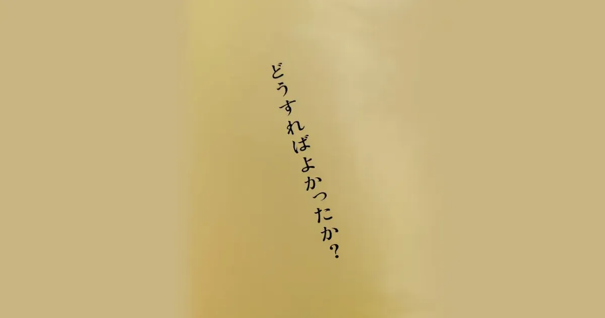

先日、ドキュメンタリー映画『どうすればよかったか？』を観た。

[https://eiga.com/movie/102543/:embed:cite]

上映が始まってから、「見なければならない作品だ」と思っていた。だが、この映画に登場する家族の姿に触れることが怖くて、なかなか観ることができなかった。

理由は、私の家族にも似たような問題があったからだ。

何かと自分自身に理由をつけ、見ることを避けてきた。そのような中、好きで購読しているブログでこの映画の感想を読み、背中を押された。

[https://goldhead.hatenablog.com/entry/2025/03/23/233908#google_vignette:embed:cite]

結論として、見てよかった。もし見なかったら後悔していたと思う。

今回、「[ポレポレ東中野](https://pole2.co.jp/)」という映画館で作品を見た。

最後にこの映画館を訪れたのは、20年以上前。『home』という映画を見に行った時だ。

[https://eiga.com/movie/40604/:embed:cite]

その当時、私は両親を説得し、3人でこの作品を見に行った。3歳年下の私の妹について、両親に伝えたいことがあったからだ。

今回はパートナーと2人で訪れた。鑑賞前の予感では、私の家族と重なる光景に目を背け、まともに見ることができない、と思っていた。だが、そんなことはなかった。

素晴らしいドキュメンタリー映画だった。

他人の家族のありのままを見る機会はなかなかない。ありのままが、生々しくスクリーンに映し出されていた。

家族それぞれの考えや苦悩が、場面が進むにつれ、じわりじわりとこちらに伝わってくる。構成と編集の巧みさゆえであろう。

過度な感情移入なしに、冷静に見ることができた。そのおかげで、自分自身の家族についても新たな視点を得ることができた。

私たち家族は、映画に登場する「藤野家」のひと回り下の世代だ。

年表を並べてみると、藤野家のお姉さんとほぼ同じ時期に、私の妹も精神を患った。妹はまだ小学生だった。

藤野家のお姉さんに向けられたプレッシャーは、映像を見ていても伝わってきた。我が家にも同様のプレッシャーがあり、これに暴力が加わる。

体が成長し体力がついた私は親に立ち向かうようになり、家に寄り付かなくなった。その結果、妹が標的になった。

弟であり、この作品の監督である藤野知明は、自分の家族を撮影し続けることで、何かを変えようとした。

一方、当時の私は両親への復讐心から荒れに荒れ、妹も巻き込んでしまった。18歳で家を出て十分な距離を置くことができてから、ようやく妹の症状や両親との関係性に向き合い始めた。

それから20数年、結果として、私が試みたことは何ももたらさなかった。

2021年3月、私の妹は自死した。

どうすればよかったか？

この問いは、家を出てから今日までずっと私の中にある。

生前も今も、毎日数回は無意識に妹のことを考える。

そのたび、さらに考えを巡らせようとするが、すぐに逃げてしまう。

この映画は、いつも逃げていた問いに向き合う機会を与えてくれた。

どうすればよかったか？

ずっとわからなかったが、今はひとつの答えが出た。

映画の中で、監督である息子が父親にインタビューする場面がある。もし、時間を巻き戻したとしても、この両親は同じ選択をするだろうと思った。そして、それは私の両親も同じだろうと。

構造主義によると、私たちの行動は環境による強い影響を受ける。その環境は、家族や社会、文化、歴史など、さまざまな要素が絡み合い構成されている。

藤野家も、私の家族も、両親たちの行動に影響を及ぼしてきた背景がある。それは彼らの両親や時代や社会であり、それもまた遡ればさらに遠くの過去にさかのぼる。

私は決定論には賛同しないが、無意識な思考や行動への強い影響を遠ざけ、まったく異なる結果に行きつくのは難しいだろうとは思う。

「もし」を考えることも、最近はやめている。

「親ガチャ」という言葉。ガチャをもう一度回して入れ替わるのは、親じゃなくて自分自身だ。

親となる人間が異なれば遺伝子も異なり、受精するタイミングが違えば生まれてくるのは別の人間だ。

つまり、私たちは、自分自身としてしか生きられないし、与えられた環境を変えることもできない。

そのうえ、環境は抗いがたい強い影響を私たちに及ぼしてくる。がんじがらめだ。

それでも、その前提を受け入れた上で「どうすればよかったか？」を考えなければならないのだと思う。

その問いを考え続けてきた先人一人一人のおかげで、地獄のような精神保健の歴史は少しずつ変わってきたのだと信じている。

この作品もまた、その一翼を担っている。

クソな私ができるせめてものことは、その隊列の端に加わり、日々その問いを考え続けること。

それが、今回「どうすればよかったか？」を観て得た答えだ。

3月23日、妹の命日だった。墓参りのあと、映画を観て、この文章を書いた。
