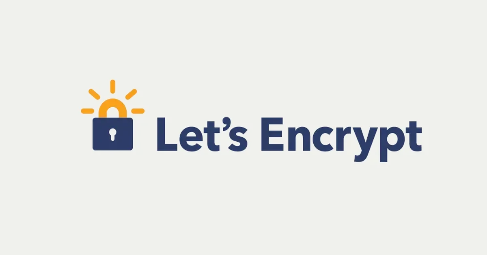

[:contents]

## 記事の概要

この記事では、Certbot（ACME Client）で、Let's Encrypt自動更新を設定する方法について解説する。

設定対象は以下のとおり。

- Cloud: Conoha VPS
- OS: Debian 12
- Container: Docker Compose 2.29.7
- Web Server: Nginx
- Web Application: ASP.NET Core Web API

上記Webアプリケーションの詳細については以下を参照。

[https://www.neputa-note.net/entry/2024/11/26/aspnetcore-nginx-docker-conoha-vps:embed:cite]

## 経緯

趣味で開発したモバイルアプリのバックエンドとして、ASP.NET Core Web APIを使用している。このWeb APIをConoha VPS上で公開しているが、HTTPS化が必要となったため、Let's Encryptを使用して証明書を取得した。

Let's Encryptの有効期間は90日であり、有効期限が切れるとWeb APIへのアクセスができなくなるため更新が必要である。これまで手動で更新していたが、有効期限切れの通知メールが廃止されるとのことで、自動更新を設定することにした。

> We’re writing to inform you that we intend to discontinue sending expiration notification emails. You can learn more in this blog post. You will receive this reminder email again in the coming months:  https://letsencrypt.org/2025/01/22/Ending-Expiration-Emails<br>
> <br>
> （訳）この度、有効期限切れ通知メールの配信を終了させていただくことになりました。 詳しくはこちらのブログ記事をご覧ください。 このリマインダーメールは、今後数ヶ月の間に再度送信されます：  https://letsencrypt.org/2025/01/22/Ending-Expiration-Emails<br>
> -- Let's Encryptからのメールより

## 作業内容

### ACME Clientについて

自動更新はCertbotというACME Clientを使用して行う

> Certbotとは？<br>
> Certbotは、手動で管理しているウェブサイトでHTTPSを有効にするために、Let's Encryptの証明書を自動的に使用するための、無料のオープンソースソフトウェアツールです。<br>
> -- [Certbotについて](https://certbot.dokyumento.jp/pages/about)より引用
<!-- -->
> ACMEとは<br>
> ACME（アクミー）はAutomatic Certificate Management Environment（自動証明書管理環境）に由来する、証明書の管理を自動化するためのプロトコルです。 ACMEの仕様はIETFで標準化され、2019年3月にRFC 8555として発行されています。<br>
> -- [ACMEについて | JPRS](https://jprs.jp/pubcert/about/ACME/)より引用

### 作業対象について

作業対象となるWeb APIアプリのDocker Composeのファイル構成は以下のとおり。

```bash
.
├── docker-compose.yml
└── nginx
    ├── Dockerfile
    ├── nginx.conf
    └── site.conf.template
```

- nginxディレクトリ以下のファイルで、nginxの設定を行っている
- ASP.Net Core Web APIアプリは、DockerHubにイメージを登録している
- docker-compose.ymlで、nginxとWeb APIアプリを起動している

### 作業方針

1. nginxに、Certbotの設定を追加する
2. docker-compose.ymlに、Certbotのコンテナを追加する
3. ログを確認し、自動更新が正常に行われることを確認する

### 作業手順

#### 1. nginxに、Certbotの設定を追加する

nginxのDockerfileとsite.conf.templateに、Certbotの設定を追加する。

##### nginx/Dockerfile

```docker
FROM nginx:latest

RUN apt-get update && apt-get install -y certbot

COPY ./nginx.conf /etc/nginx/nginx.conf
COPY ./site.conf.template /etc/nginx/templates/site.conf.template

// [!code ++]
RUN mkdir -p /var/www/certbot

CMD [ "nginx", "-g", "daemon off;" ]
```

##### nginx/site.conf.template

```log
upstream app {
    server app:5000;
}

server {
    listen 80;
    server_name makuta-kobo-app.top www.makuta-kobo-app.top;

    location / {
       return 301 https://$host$request_uri;
    }

    location /.well-known/acme-challenge/ {
        root /var/www/certbot;
    }
}

server {
    listen 443 ssl;
    server_name makuta-kobo-app.top www.makuta-kobo-app.top;
    ssl_certificate /etc/letsencrypt/live/makuta-kobo-app.top/fullchain.pem;
    ssl_certificate_key /etc/letsencrypt/live/makuta-kobo-app.top/privkey.pem;
    location / {
        proxy_pass         http://app;
        proxy_set_header   Host $host;
        proxy_set_header   Connection keep-alive;
        proxy_set_header   X-Real-IP $remote_addr;
        proxy_set_header   X-Forwarded-For $proxy_add_x_forwarded_for;
        proxy_set_header   X-Forwarded-Proto $scheme;
        proxy_set_header   X-Forwarded-Host $server_name;
    }
}
```

#### 2. docker-compose.ymlに、Certbotのコンテナを追加する

```docker
services:
  app:
    image: XXXXXX/repos:latest
    environment:
      - XXX=XXXXX
      - XXX=XXXXX
    ports:
      - "5000:5000"
    networks:
      - webnet

  nginx:
    build:
      context: ./nginx
    environment:
      BACKEND_HOST: "app:5000"
    volumes:
      - /etc/letsencrypt:/etc/letsencrypt:ro
      - /var/www/certbot:/var/www/certbot
    ports:
      - "80:80"
      - "443:443"
    networks:
      - webnet

  certbot:
    image: certbot/certbot
    volumes:
      - /etc/letsencrypt:/etc/letsencrypt
      - /var/www/certbot:/var/www/certbot
    entrypoint: "/bin/sh -c 'trap exit TERM; while :; do certbot renew; sleep 12h; done'"

networks:
  webnet:
```

#### 3. ログを確認し、自動更新が正常に行われることを確認する

Web API、nginxに加え、Certbotのコンテナも起動していることを確認する。
今回は、onethird-certbot-1が追加されたことを確認。

##### docker-compose-ps

```bash
docker compose ps
NAME                 IMAGE                 COMMAND                   SERVICE
onethird-app-1       xxxxxx/repos:latest   "./OneThird.WebAPI"       app
onethird-certbot-1   certbot/certbot       "/bin/sh -c 'trap ex…"   certbot
onethird-nginx-1     onethird-nginx        "/docker-entrypoint.…"   nginx
```

Certbotのログを確認する。以下は、期限切れではないので更新しない旨のログ。

```bash
docker compose logs certbot
certbot-1  | Certificate not yet due for renewal
certbot-1  |
certbot-1  | - - - - - - - - - - - - - - - - - - - - - - - - - - - - - - - - - - - - - - - -
certbot-1  | The following certificates are not due for renewal yet:
certbot-1  |   /etc/letsencrypt/live/your-domain.com/fullchain.pem expires on 2025-04-25 (skipped)
certbot-1  | No renewals were attempted.
- - - - - - - - - - - - - - - - - - - - - - - - - -
```

以上で、Certbotによる自動更新の設定が完了した。
