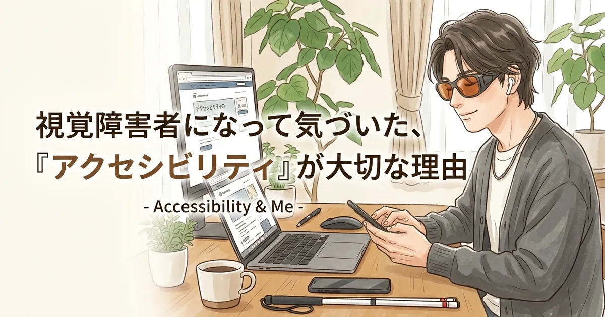

[:contents]

## 記事の概要

網膜の病気の影響により視覚に頼らない生活へシフトしていくなかで、日々さまざまな問題に直面する。そんな中で関心が向いた先が「アクセシビリティ」という言葉、概念である。

ふつうにモノが見えていた頃から耳にしたことのある単語だった。だがその重要性を知るに至ったのは、自分が障害当事者になってからのこと。

無関係でいられなくなったからには正しく学び、ユーザー視点で広める側に回らなければいけない気がしてきた。なぜなら生活に直結する切実な問題だからだ。

本来、アクセシビリティは、施設、移動手段、通信など広い範囲に及ぶものだが、本記事では「Webアクセシビリティ」について言及する。

障害当事者として直面した困りごと、そして今後学んでいきたいことを決意表明の意味も込めてまとめる。

## アクセシビリティとは

> アクセシビリティ（英: accessibility、略称: A11Y）とは、障害者が他の人と同じように物理的環境、輸送機関、情報通信及びその他の施設・サービスを利用できることをいう。 
> -- [アクセシビリティ - Wikipedia](https://ja.wikipedia.org/wiki/%E3%82%A2%E3%82%AF%E3%82%BB%E3%82%B7%E3%83%93%E3%83%AA%E3%83%86%E3%82%A3) より引用

アクセシビリティとは、障害の有無にかかわらず、すべての人が情報やサービスにアクセスしやすい状態を指す。

本記事のテーマである「Webアクセシビリティ」は、視覚障害者や聴覚障害者などがインターネット上の情報を利用する際の利便性を高めることを目的としている。

> ウェブアクセシビリティは、ウェブにおけるアクセシビリティのことです。利用者の障害などの有無やその度合い、年齢や利用環境にかかわらず、あらゆる人々がウェブサイトで提供されている情報やサービスを利用できること、またその到達度を意味します。 
> -- [ウェブアクセシビリティとは？ 分かりやすくゼロから解説！ | 政府広報オンライン](https://www.gov-online.go.jp/article/202310/entry-10148.html) より引用

## 視覚障害当事者として直面した困りごと

## 今後学んでいきたいこと

## まとめ
